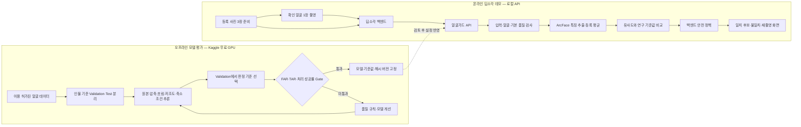

# 딥소각 얼굴가드 데모 파이프라인 v0.1

## 한 문장으로 설명

딥소각 데모 백엔드가 **미리 준비한 등록 얼굴 3장과 지금 촬영한 확인 얼굴 1장**을 얼굴가드 API에 보내고, API가 같은 사람 후보인지 계산하면 백엔드가 결과를 안전한 화면 상태로 바꿔 사용자에게 보여준다.

현재 결과는 연구용 얼굴 유사도다. 데모 화면에는 반드시 다음 문구를 표시한다.

> 얼굴 일치 후보를 확인하는 연구 데모입니다. 운영 본인인증 결과가 아닙니다.

## 데모 범위

| 구분 | v0.1에서 하는 것 | v0.1에서 하지 않는 것 |
|---|---|---|
| 얼굴 비교 | 등록 얼굴 1~5장과 확인 얼굴 1장 비교, 3장 권장 | 여러 사용자 중 누구인지 찾는 1:N 검색 |
| 입력 검사 | JPEG·PNG·WEBP, 용량·해상도, 얼굴 없음·여러 명·작은 얼굴 검사 | 저조도·흐림을 검증된 기준으로 자동 거절 |
| 모델 | InsightFace `buffalo_l` 탐지·인식, 512차원 특징, 코사인 유사도 | 라이브니스·사진 재촬영·화면 재생 공격 탐지 |
| 판정 | 연구 기준값과 `is_same_person` 후보 결과 반환 | 운영 본인인증 성공 선언 |
| 저장 | 요청 처리 중 임시 버퍼만 사용 | 사진·얼굴 crop·임베딩의 영구 저장 |
| 후속 행동 | 결과 화면과 사용자 재확인 | 얼굴 결과 하나만으로 삭제·복구 자동 실행 |

Swagger 화면에서 등록 사진과 확인 사진을 함께 올리는 것은 **개발자 모델 테스트**다. 이것만으로 계정 소유자를 증명할 수는 없다. 딥소각 통합 데모에서는 등록 사진을 사용자가 확인 단계에서 새로 선택하게 하지 않고, 동의받은 발표자의 등록 사진 3장을 데모 시작 전에 백엔드 메모리에 준비한다.

## 전체 구조: 오프라인 모델 평가와 온라인 데모를 분리한다



Kaggle은 사용자 요청을 처리하는 서버가 아니다. 촬영 품질이 나쁠 때 모델이 얼마나 흔들리는지 평가하고, 검토가 끝난 모델과 판정 기준만 온라인 API에 반영한다.

- `FAR`: 다른 사람을 같은 사람으로 잘못 받아들이는 비율
- `TAR`: 같은 사람을 같은 사람으로 올바르게 받아들이는 비율

## 데모 시작 전 준비

1. 발표자에게 얼굴 사진 사용 목적과 삭제 시점을 설명하고 동의를 받는다.
2. 발표자의 서로 다른 정면 사진 3장을 준비한다. 같은 파일을 복사해 3장으로 만들지 않는다.
3. 사진은 GitHub, Docker 이미지, 브라우저 저장소에 넣지 않는다.
4. 딥소각 백엔드가 등록 사진을 데모 세션의 메모리에만 보관하도록 준비한다.
5. 얼굴가드 API를 실행하고 `/health`를 확인한다.
6. 동의받은 테스트 사진으로 첫 요청을 보내 모델 다운로드와 지연 로딩을 끝낸다.
7. 첫 요청을 제외한 처리시간을 5회 이상 측정해 데모 환경의 중앙값과 최댓값을 기록한다.

처음 실행할 때는 `.env.example`을 `.env`로 복사하고, InsightFace 가중치 이용 조건을 직접 확인한 경우에만 `FACEGUARD_ACCEPT_NONCOMMERCIAL_MODEL_LICENSE=true`로 바꾼다.

```bash
docker compose up --build --detach
curl http://127.0.0.1:8000/health
```

정상 준비 상태는 `status=ok`, `license_accepted=true`다. 첫 추론 전에는 `model_loaded=false`일 수 있고, 첫 추론 후에는 `model_loaded=true`와 64자리 `model_fingerprint`가 표시돼야 한다.

## 사용자 데모 순서

1. **안내 화면**: 연구 데모이며 사진을 영구 저장하지 않는다고 알린다.
2. **촬영 동의**: 사용자가 동의하지 않으면 얼굴 촬영 없이 종료한다.
3. **확인 얼굴 촬영**: 정면, 한 명, 밝은 조명, 얼굴을 충분히 크게 촬영한다.
4. **백엔드 전송**: 브라우저는 얼굴가드 API를 직접 호출하지 않는다. 딥소각 백엔드가 등록 사진 3장과 확인 사진 1장을 multipart 요청으로 전달한다.
5. **모델 처리**: 사진별 얼굴을 하나만 탐지하고 특징을 만든 뒤, 등록 특징 평균과 확인 특징의 코사인 유사도를 계산한다.
6. **안전한 결과 변환**: 백엔드는 HTTP 상태, 오류 코드, `is_same_person`, `threshold_status`를 화면 상태로 변환한다.
7. **사용자 확인**: 일치 후보여도 실제 삭제·복구를 자동 실행하지 않고 사용자가 데모 동작을 한 번 더 확인한다.
8. **정리**: 응답 후 업로드 버퍼를 닫고, 데모 종료 시 백엔드 메모리의 등록 사진과 임시 파일을 제거한다.

API 요청 형식은 다음과 같다.

```text
POST /v1/faceguard/verify
Content-Type: multipart/form-data

reference_images: 등록 사진 1
reference_images: 등록 사진 2
reference_images: 등록 사진 3
query_image:       지금 촬영한 확인 사진
```

## 백엔드 판정 규칙

백엔드는 `is_same_person`만 보고 행동하지 않는다. 다음 순서로 처리한다.

```text
1. HTTP 요청 성공 여부 확인
2. 오류 코드가 있으면 재촬영 또는 서비스 오류 화면으로 이동
3. threshold_status가 approved인지 확인
4. 현재처럼 research_only_unapproved이면 연구 데모 경고 표시
5. is_same_person=true이면 '일치 후보' 화면 표시
6. is_same_person=false이면 '일치 확인 안 됨' 화면 표시
7. 어떤 경우에도 얼굴 결과만으로 파괴적 동작을 자동 실행하지 않음
```

| API 결과 | 데모 화면 상태 | 화면 문구와 행동 |
|---|---|---|
| `200`, `is_same_person=true` | `MATCH_CANDIDATE_RESEARCH` | “같은 사람 후보입니다.” 연구용 경고와 수동 확인 버튼 표시 |
| `200`, `is_same_person=false` | `NO_MATCH` | “일치를 확인하지 못했습니다.” 한 번 재촬영 허용 |
| `NO_FACE` | `RETRY_CAPTURE` | 정면에서 밝고 가깝게 재촬영 안내 |
| `MULTIPLE_FACES` | `RETRY_CAPTURE` | 혼자 나온 화면으로 재촬영 안내 |
| `FACE_TOO_SMALL` | `RETRY_CAPTURE` | 카메라에 더 가까이 오도록 안내 |
| `LOW_DETECTION_SCORE` | `RETRY_CAPTURE` | 흔들림·가림을 줄이도록 안내 |
| `IMAGE_TOO_LARGE`, `TOO_MANY_PIXELS` | `INVALID_IMAGE` | 이미지 크기 축소 안내 |
| `MODEL_UNAVAILABLE`, `503`, timeout | `SERVICE_UNAVAILABLE` | 동작을 실행하지 않고 데모 운영자에게 전환 |

실패나 timeout에서는 항상 **아무 작업도 실행하지 않는 방향으로 닫는다**. 같은 요청의 자동 무한 재시도는 하지 않는다.

## 화면 상태

| 순서 | 상태 | 다음 상태 |
|---:|---|---|
| 1 | `INTRO` | 동의 → `CAPTURE_QUERY`, 거부 → `CANCELLED` |
| 2 | `CAPTURE_QUERY` | 촬영 완료 → `VERIFYING` |
| 3 | `VERIFYING` | API 결과에 따라 결과·재촬영·오류 상태 |
| 4 | `RETRY_CAPTURE` | 최대 한 번 재촬영 → `VERIFYING` |
| 5 | `MATCH_CANDIDATE_RESEARCH` | 사용자 수동 확인 → 데모 동작 |
| 6 | `NO_MATCH` | 종료 또는 재촬영 |
| 7 | `SERVICE_UNAVAILABLE` | 파괴적 동작 없이 종료 |

## 로그와 개인정보 규칙

얼굴가드 API와 딥소각 백엔드의 데모 로그에는 다음만 남긴다.

- 임의의 요청 ID
- 성공·불일치·오류 결과
- 오류 코드
- 처리시간
- 모델 이름과 모델 지문
- 판정 기준 상태

다음은 남기지 않는다.

- 원본 사진과 얼굴 crop
- multipart 본문과 파일명
- 512차원 임베딩
- 사용자 이름·계정 ID와 모델 로그의 직접 연결
- 사람별 원시 유사도 목록

API 응답에는 단일 요청의 `similarity`가 포함되지만, 데모 로그에 장기 보관하지 않는다.

## 데모 통과 시험표

| 시험 | 입력 | 기대 결과 |
|---|---|---|
| 서버 준비 | `/health` | `status=ok`, 라이선스 확인, 첫 추론 후 모델 지문 존재 |
| 같은 사람 | 발표자 등록 3장 + 발표자 확인 1장 | HTTP 200, 일치 후보 화면 |
| 다른 사람 | 발표자 등록 3장 + 동의받은 다른 사람 확인 1장 | HTTP 200, 불일치 화면 |
| 얼굴 없음 | 풍경 사진 | `NO_FACE`, 재촬영 화면 |
| 여러 얼굴 | 두 명이 나온 사진 | `MULTIPLE_FACES`, 재촬영 화면 |
| 작은 얼굴 | 멀리 있는 한 명 | `FACE_TOO_SMALL`, 재촬영 화면 |
| 잘못된 형식 | HEIC 또는 텍스트 파일 | 지원 형식 안내 |
| 서버 중단 | API를 끈 상태 | 서비스 오류 화면, 후속 동작 없음 |
| 개인정보 | 로그·Git 변경사항 검사 | 사진·파일명·임베딩 없음 |

같은 사람·다른 사람 시험 한 건이 통과해도 정확도를 증명하지 않는다. 이 표는 데모 파이프라인 연결과 실패 처리가 의도대로 동작하는지를 확인한다.

## 데모 이후 고도화 순서

### v0.2 — 품질 강건성

1. Kaggle에서 원본·JPEG 압축·흐림·저조도·축소·복합 열화 조건을 평가한다.
2. 인물 비중복 Validation에서 판정 기준을 다시 선택한다.
3. 흐림·밝기 재촬영 기준을 데이터로 정한다.
4. 등록 사진 단순 평균과 품질 가중 평균을 비교한다.
5. 목표 FAR, TAR 손실, 처리 성공률 Gate를 통과한 설정만 API 후보로 올린다.

### v1.0 — 운영 후보

- 이용권이 해결된 모델 또는 승인 데이터로 학습한 모델
- 한국인·실제 휴대전화 촬영 데이터의 외부 검증
- 라이브니스와 사진·화면 재생 공격 방어
- 신뢰할 수 있는 등록 절차와 암호화된 템플릿 저장소
- 서비스 간 인증, TLS, 요청 제한, 감사 로그, 모델 롤백
- 얼굴 결과 외 추가 인증을 포함한 삭제·복구 정책

운영 조건을 모두 충족하기 전까지 API의 `threshold_status`는 `research_only_unapproved`로 유지한다.

## 데모 종료 체크리스트

- [ ] 백엔드 메모리와 임시 폴더의 등록·확인 사진 제거
- [ ] 브라우저 파일 선택과 카메라 미리보기 초기화
- [ ] Git 상태에서 이미지·영상·임베딩 파일이 없는지 확인
- [ ] 모델 버전·지문, 성공 여부, 지연시간만 결과 기록
- [ ] Docker 서비스를 종료할 필요가 있으면 `docker compose down` 실행
