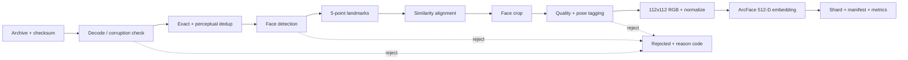
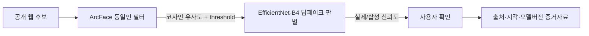

# 딥소각 얼굴가드 한국인 안면 이미지 실험계획

> 문서 상태: 실행 전 계획 / 기준일 2026-08-05<br>
> 수치 표기: **목표값**(제품 판단 기준), **추정값**(가정에 따른 계산), **실측값**(로그에서 수집)<br>
> 핵심 원칙: 얼굴 **동일인 유사도**와 **딥페이크 확률**은 서로 다른 모델·지표로 다룬다.

## 0. 실행 전 게이트: 라이선스, 보안, 환경

얼굴 이미지는 사람을 식별할 수 있는 생체정보이다. 따라서 모델 성능보다 데이터 이용 권한을 먼저 확정한다. 다음 항목 중 하나라도 `No` 또는 `미확인`이면 원본을 다운로드·열람·처리하지 않는다.

| 게이트 | 현재 상태 | 증빙/조치 |
|---|---|---|
| 제공기관 신청 승인 | **미확인** | 다운로드 승인 화면·이메일 보관 |
| 연구/해커톤 이용 허용 | **미확인** | 신청 시 동의한 개별 약관 저장 |
| 상업 서비스 활용 | **재확인 필수** | AI-Hub 정책은 영리·비영리 R&D 활용을 안내하지만, 데이터셋 판매 등은 별도 협의 필요 |
| 제3자 재배포/열람 | **금지** | 승인받은 작업자만 최소권한 접근 |
| 국외 반출/국외 클라우드 | **사전 합의 전 금지** | 저장소·백업 리전 확인 |
| 원본의 Git/클라우드 업로드 | **금지** | `.gitignore`, 로컬 암호화, 접근 로그 |
| 모델 사용권 | **상용화 전 미해결** | InsightFace 코드는 MIT이지만 제공 사전학습 모델은 비상업 연구용. 상용 라이선스 또는 사용 가능한 자체 가중치 필요 |
| 폐기 절차/보관 기간 | **미확인** | 담당자·만료일·보안삭제 방법 기록 |

공식 확인 출처:

- [AI-Hub 데이터 이용정책](https://aihub.or.kr/intrcn/guid/usagepolicy.do?currMenu=151&topMenu=105): 출처 표시, 제3자 제공 금지, 국외 반출 사전 합의, 재식별 금지 등을 실험 전 재확인한다.
- [AI-Hub 딥페이크 변조 영상(dataset 55)](https://aihub.or.kr/aihubdata/data/view.do?currMenu=115&topMenu=100&aihubDataSe=data&dataSetSn=55): 일반 얼굴 인식용이 아니라 실제·합성을 포함한 딥페이크 판별용이므로 12절 실험에만 사용한다.
- [AI-Hub Shell 안내](https://aihub.or.kr/devsport/apishell/list.do?currMenu=403&topMenu=100): 승인 후 다운로드, 분할 압축 병합, 해제용 2~3배 공간 확보 안내를 반영한다.
- [K-FACE 데이터셋 논문](https://arxiv.org/abs/2103.02211): 1,000명, 100만 장 이상, pose·조명·표정·가림 조건을 보고한다. **논문 접근권과 이미지 데이터 이용권은 다르므로**, 신청 화면의 최신 데이터 약관을 별도 보관한다.
- [ArcFace 원 논문](https://openaccess.thecvf.com/content_CVPR_2019/html/Deng_ArcFace_Additive_Angular_Margin_Loss_for_Deep_Face_Recognition_CVPR_2019_paper.html), [InsightFace 라이선스](https://github.com/deepinsight/insightface#license): 알고리즘, 코드, 사전학습 가중치의 라이선스를 구분한다.

### 현재 로컬 환경 실측

2026-08-05에 실험 저장소 경로에서 확인한 값이다. 재실행 시 `python scripts/faceguard_plan.py env --path .`로 갱신한다.

| 항목 | 실측값 | 판정 |
|---|---:|---|
| CPU | Apple M4, physical/logical 10/10 cores | Debug/Pilot CPU 비교 가능 |
| RAM | 24GB unified memory | 전체 RAM 적재 금지, streaming 필수 |
| GPU | Apple M4 10-core, PyTorch MPS available | CUDA 결과와 분리 기록 |
| PyTorch | 2.8.0 | 실험 lock file에 버전 고정 필요 |
| 사용 가능 디스크 | 약 176GiB | **100GB Full Set No-Go**; 250~300GB 이상 여유 확보 전 진행 금지 |
| 인터넷 실제 속도 | **미측정** | 유선 환경에서 3회 측정, median 사용 |
| 압축 전/후 크기 | 예상 압축본 100GB / 해제본 **미측정** | 샘플 shard 1개로 압축비 실측 후 전체 추정 |

### Colab 사용 결정

주 연산 환경은 Google Colab으로 하되, 원본 얼굴/정렬본/임베딩의 hosted Colab·Drive 반출은 제공약관과 보안 승인 전에 금지한다. 승인 전에는 Colab local runtime 또는 비식별 Debug data만 사용한다. 승인 후 hosted GPU는 2~10GB shard 단위로 실행하고, 세션 종료에 대비해 shard별 checkpoint와 `_SUCCESS`를 남긴다. 세부 절차는 [Colab 실행 가이드](colab.md)와 [`notebooks/faceguard_colab.ipynb`](../../notebooks/faceguard_colab.ipynb)를 따른다.

---

## 1. 실험 목표와 검증 가설

서비스의 출력은 `candidate belongs to registered person`에 대한 유사도/판정이다. ArcFace 512차원 임베딩을 L2 정규화한 후 코사인 유사도를 계산한다. 임계값은 사전학습 모델의 관행값을 복사하지 않고 validation set에서 선정한다.

| 가설 | 독립변수 | 종속변수 | 통제조건 | 평가방법 | 성공 기준 | 예상 한계 |
|---|---|---|---|---|---|---|
| H1. 범용 ArcFace만으로 한국인 동일인 판별이 가능한가? | 사전학습 모델/threshold | ROC-AUC, EER, TAR@FAR, FAR/FRR | 동일 split·pair·정렬·입력 | Test 1:1 verification + 검색 | **목표** TAR@FAR=1e-3 ≥0.90, 주요 조건군에서 상대 TAR 하락 ≤10%p. 사업 위험에 따라 재승인 | Pilot 표본으로 극저 FAR 추정은 넓은 CI |
| H2. 한국인 데이터 파인튜닝이 유의미한가? | frozen/partial/full fine-tune | H1 지표 차이, 학습비용 | 동일 초기가중치·split·seed 목록 | 인물 단위 bootstrap 95% CI, 3 seeds | **목표** 핵심지표 개선 CI의 하한>0이고 최소 +2%p TAR 또는 EER 20% 상대감소. 비용 한도 내 | 선택 데이터 편향, catastrophic forgetting |
| H3. 셀카 3장과 5장의 등록 성능 차이가 있는가? | reference 3/5, pooling 방식 | TAR/FAR, Recall@K, 등록 시간, 이탈률 | 같은 query, 인물내 paired sampling | 인물별 paired bootstrap | **목표** 5장의 성능 이득과 추가 UX 비용을 동시 보고. +1%p 미만이거나 이탈 증가가 크면 3장 선택 | 실제 이탈률은 이미지 실험만으로 확정 불가 |
| H4. 조명·표정·화질·자세 변화에 견고한가? | 조건 bucket | 조건별 TAR/FRR, 탐지 실패율 | 고정 test protocol, 무작위 증강 금지 | 전체 대비 조건별 격차+CI | **목표** 모든 핵심 운영 bucket 표본수 확보, 조건별 FRR 운영 한도 이내 | 10대·마스크 등 부족 그룹은 탐색적 결과로만 표기 |
| H5. 모바일에서 허용 지연시간을 달성하는가? | PyTorch/ONNX/TFLite, backbone, precision | p50/p95 latency, peak RAM, size, 배터리 | 같은 aligned input, warm-up, thread 수 | 실기기 3회×각 100회, cold/warm 분리 | **초기 목표** 임베딩 p95 ≤150ms, 모델 ≤50MB. 제품 UX 검토 후 확정 | 현재 Mac 속도는 iOS/Android 대체값이 아님 |

`TAR@FAR=1e-3` 등은 확인된 성능이 아니라 해커톤용 **초기 목표**다. 웹 후보 수, 오탐 후 사용자 피해, 인간 확인 단계의 유무를 반영해 제품 담당자가 FAR 상한을 승인한다.

---

## 2. 단계별 데이터 사용 전략

궁극적 샘플 수는 파일 목록을 스캔한 후 확정한다. 얼굴가드 protocol은 5장 reference + 5~10장 query가 필요하므로 인물당 **최소 10장, 권장 15장**을 우선 선별한다. `S_raw`, `S_aligned`, `t_pre`, `t_emb`는 Debug Set 실측값이다.

| 단계 | 인물 수 | 인물당 이미지 | 전체 이미지 | 예상 크기 | 전처리 시간 | 임베딩 시간 | 필요 공간 | 산출물/승격 조건 |
|---|---:|---:|---:|---:|---:|---:|---:|---|
| Debug | 초기 20~50, 제안 30 | 10~15 | 200~750, 제안 450 | `N×S_raw` | `N×t_pre/P_eff` | `N×t_emb/P_eff` | 압축 shard+원본+중간산출물 | loader, reject reason, resume, manifest, 0 leakage |
| Pilot | 초기 200~500, 제안 300 | 10~15 | 2,000~7,500, 제안 4,500 | Debug 평균×N | Debug p50/p95×N | Debug p50/p95×N | 실측 배수로 계산 | A/B baseline, threshold, 3 vs 5, 조건별 CI, Full Go/No-Go |
| Full | manifest의 적합 인물 수 | protocol 충족 인물만 | 미확정 | manifest 실측 | Pilot 실측×N | Pilot 실측×N | 최소 250GB, 권장 300GB+ 재산정 | Pilot에서 파인튜닝/조건 보강의 필요가 입증된 경우만 |

`P_eff`는 병렬 프로세스 수가 아니라 I/O 경합과 batch 효율을 포함한 **실효 병렬도**다. Debug에서 worker 1/2/4/8을 비교해 성공 이미지/s가 가장 높은 값을 사용한다.

Pilot의 300명은 확정값이 아니다. 주요 그룹(20대 남/여, 정면/측면, 고/저화질, 밝음/어두움)에서 인물 단위 bootstrap CI를 구할 수 있는지 먼저 확인한다. 10대·마스크 등 부족 그룹은 Full로 억지 확대하지 말고 `insufficient sample`로 표시한다.

---

## 3. 다운로드 및 저장공간 계획

### 3.1 100GB 다운로드

계산은 decimal 100GB = 800Gb를 사용한다.

`download_seconds = size_GB × 8,000 / Mbps`

네트워크 손실 반영 예상시간은 **추정 실효률 80%**를 쓴 값이다. 실제로는 유선 환경 3회 speed test median과 제공자 서버의 5~10GB shard 실측 처리량 중 더 낮은 값을 쓴다.

| 표시 속도 | 이론적 최소 | 80% 실효 추정 | 다운로드 재개 | 체크섬 검증 | 압축 해제 |
|---:|---:|---:|---|---|---|
| 50Mbps | 4h 26m 40s | 5h 33m 20s | 제공 CLI의 resume 실측 필요 | `100GB / measured_hash_MBps` | `compressed_input / measured_extract_MBps`; 해제 크기 반영 |
| 100Mbps | 2h 13m 20s | 2h 46m 40s | 동일 | 동일 | 동일 |
| 500Mbps | 26m 40s | 33m 20s | 동일 | 동일 | 동일 |
| 1Gbps | 13m 20s | 16m 40s | 동일 | 동일 | 동일 |

체크섬과 해제 속도는 디스크, 압축 알고리즘, 파일 개수에 따라 크게 달라 지므로 확정 시간을 만들지 않는다. 예시로 실측 hash 500MB/s면 100GB 검증은 **추정 200초**, 실측 해제 200MB/s면 압축 입력 100GB 기준 **추정 500초 + 확장된 파일 쓰기 비용**이다. 이 예시값은 실측값으로 교체한다.

실행:

```bash
python scripts/faceguard_plan.py download \
  --size-gb 100 --efficiency 0.8 \
  --checksum-mbps 500 --extract-mbps 200
```

재개 지원은 문서만 보고 단정하지 않고, Debug shard 중 1개를 중단한 후 다시 실행해 부분 파일이 이어받기 되는지 확인한다. shard별 예상 bytes, 실제 bytes, 제공 체크섬, 로컬 SHA-256, 재시도 횟수를 manifest에 남긴다.

### 3.2 저장공간

| 항목 | 산정식 | 100GB 압축본 기준 초기 예시 |
|---|---|---:|
| 압축파일 | 제공 파일 크기 | 100GB (주어진 예상) |
| 해제 원본 | `100GB × measured_expand_ratio` | **추정 150GB** (1.5× 가정; shard 실측 필요) |
| 전처리 이미지 | `accepted_images × mean_aligned_bytes` | **추정 30GB**; JPEG 품질·PNG 여부에 따라 변동 |
| 임베딩 | `N × 512 × dtype_bytes` + index | N=1,000,000, float32이면 2.048GB + metadata |
| 학습 체크포인트 | `saved_epochs × checkpoint_size` | **추정 10GB**, best/last+resume만 유지 |
| 로그·결과 | manifest, plots, profiler, failures | **추정 5GB**; 실제 얼굴 샘플은 접근제어 영역 |
| 합계 | 위 항목 합 | **추정 약 297GB** |

- **최소 필요공간 250GB**: shard를 순차 처리하고 검증된 압축본/중간산출물을 보관정책 내에서 제거할 수 있을 때의 운영 하한이다.
- **권장 300GB 이상**: 압축본, 해제본, 정렬본을 동시에 지니고 체크포인트·로그·파일시스템 여유를 남긴다.
- 2.5~3×가 필요한 이유는 압축본과 해제본의 동시 존재, 정렬 Crop의 추가 저장, 분할 압축 병합 시 순간 복제, 체크포인트/임시파일, SSD 성능을 위한 여유공간 때문이다.

현재 실측 여유 176GiB에서는 Full Set을 받지 않는다. Debug/Pilot shard만 받거나, 암호화된 별도 SSD에 300GB 이상 여유를 확보한 후 진행한다.

---

## 4. 데이터 보안 및 라이선스 체크리스트

- [ ] AI-Hub/제공기관 이용약관의 버전·동의일·신청자를 기록했다.
- [ ] 해커톤 연구·개발 사용이 허용되며 상용 제품 전환 조건을 따로 확인했다.
- [ ] 제3자 재배포/양도/대여/무단 열람 금지 조항을 확인했다.
- [ ] 얼굴 생체정보와 파생 임베딩의 처리 조건을 확인했다.
- [ ] 승인된 계정/작업자만 최소권한으로 접근하며 접근 로그를 남긴다.
- [ ] FileVault 또는 동등한 디스크 암호화가 활성화되었다.
- [ ] 원본/처리본/임베딩/로그의 보관 만료일과 책임자가 있다.
- [ ] 폐기 시 암호화 키 폐기 또는 보안삭제 후 파일수/용량 0을 검증한다.
- [ ] `data/raw`, `interim`, `aligned`, `rejected`, `embeddings`, `metadata`, `splits`, `logs`가 Git 및 무승인 클라우드 동기화에서 제외되었다.
- [ ] 실제 얼굴을 발표·Before/After·실패 사례에 공개할 별도 동의와 공개 범위가 있다.
- [ ] InsightFace 제공 사전학습 모델의 비상업 제약을 인지했고 상용화 대체 가중치/계약 계획을 남겼다.
- [ ] 통계에 필요 없는 직접식별자(이름, 연락처)를 manifest에 보관하지 않는다.

---

## 5. 데이터 전처리 파이프라인



| 단계 | 라이브러리 후보 | 입력 → 출력 | 실패 조건/코드 | 필수 로그 | 시간 측정 | 재실행 방지 |
|---|---|---|---|---|---|---|
| 원본 검증 | `hashlib`, `zipfile`, 제공 CLI | archive → verified shard | size/checksum mismatch | shard id, bytes, sha256 | shard wall time | 검증 manifest의 hash가 같으면 skip |
| 손상 제거 | Pillow/OpenCV | bytes → decoded RGB | decode/EXIF/크기 이상 | path, exception, W×H | decode timer | source hash+step version key |
| 중복 제거 | SHA-256, pHash/imagehash | image → canonical id | exact/near duplicate | sha256, phash, distance, kept id | hash time | hash index 재사용 |
| 얼굴 탐지 | SCRFD/RetinaFace/MTCNN | RGB → bbox+score | 0 face, multi-face, low score, tiny face | bbox, score, face count | batch+image timer | detector/version/input hash key |
| 5 랜드마크 | detector output | face → 5 points | missing/out-of-bounds | points, confidence | detector와 분리 또는 통합 | detection artifact 재사용 |
| 얼굴 정렬 | OpenCV/InsightFace transform | points+RGB → aligned RGB | transform singular, excessive crop | affine matrix, padding ratio | transform timer | matrix+version key |
| Crop | OpenCV/Pillow | aligned → crop | face clipped, invalid size | crop bbox, W×H | crop timer | aligned artifact key |
| 품질 필터 | Laplacian/BRISQUE 후보, pose estimator | crop → accepted/tagged/rejected | blur/exposure/occlusion 임계 초과 | quality raw score, reason, yaw/pitch/roll | metric timer | score를 저장해 threshold만 재적용 |
| 112×112 RGB | torchvision/OpenCV | crop → tensor/image | wrong channel/shape/range | resize mode, color order | transform timer | preprocessing fingerprint |
| 정규화 | PyTorch | uint8 → float tensor | NaN/Inf/range mismatch | dtype, min/max/mean | batch timer | config hash |
| 임베딩 | PyTorch/ONNX Runtime | tensor → L2-normalized float[512] | wrong dim, NaN, zero norm | model hash, device, norm, latency | warm-up 후 batch+image | model+preprocess+source hash key |
| 메타데이터 | CSV/Parquet, NumPy | artifacts → shard/index | schema/null/foreign-key error | run id, subject pseudonym, split, condition, hashes | write/flush timer | atomic temp→final, `_SUCCESS` marker |

권장 구조:

```text
data/
  raw/          # 압축본/원본, 읽기 전용
  interim/      # 해제·임시 shard
  aligned/      # 112x112 정렬본
  rejected/     # 원본 복사 대신 reason manifest 우선
  embeddings/   # .npy/.npz 또는 memory-mapped shard
  metadata/     # Parquet manifest, 개인식별자 금지
  splits/       # subject-level split manifest
  logs/         # JSONL stage/run metrics
outputs/
  metrics/
  plots/
  profiles/
```

전체를 RAM에 적재하지 않는다. archive/shard → file stream → bounded queue → batch inference → append-only output으로 처리하고, shard 완료 시 `_SUCCESS`와 config/model/source hash를 쓴다. 중단 후에는 성공 shard를 건너뛰고 미완료 shard만 재실행한다.

---

## 6. 데이터 분할 원칙

1. 원본 제공 subject ID를 프로젝트 내 pseudonymous ID로 변환한다.
2. subject ID를 연령대·성별 등 주요 속성으로 stratify하여 Train 70% / Validation 15% / Test 15%로 고정한다.
3. 모든 이미지·연속 촬영·편집본·원본에서 파생된 frame은 subject split을 따른다.
4. 증강은 split 후 Train에서만 online으로 적용한다. Validation/Test에는 무작위 증강을 금지한다.
5. Validation에서 임계값·pooling·품질 임계를 고른 후 Test는 단 한 번 평가한다.

누수 검사:

- subject ID가 둘 이상 split에 존재하는지
- `source_id`(원본/편집본 그룹)가 split을 가로지르는지
- SHA-256이 같은 파일이 다른 split에 있는지
- pHash 거리가 작은 근접 중복/연속 프레임이 나뉘었는지
- `is_augmented=true`가 Validation/Test에 존재하는지

실행:

```bash
python scripts/validate_faceguard_manifest.py examples/faceguard_manifest.csv
```

Negative pair는 같은 test subject 집합 안에서 생성하되, 수많은 easy negative가 Accuracy를 부풀리지 않도록 일반 negative와 hard negative의 수를 따로 고정하고 결과를 분리 보고한다.

---

## 7. 얼굴 각도 및 데이터 증강

### A. 카메라 기울기/Roll

- 고정 Test: 원본, -15°, -10°, -5°, +5°, +10°, +15°. 생성 코드·interpolation·border policy·seed를 고정한다.
- Train: `RandomRotation(-15°, +15°)` 온라인 증강을 우선하여 파일 증가를 피한다.
- 회전 후 정렬을 재적용할지, 정렬된 crop에 회전을 적용할지는 실험 목적이 다르므로 별도 case로 기록한다.

### B. 실제 Head Pose

2D roll은 yaw/pitch를 만들지 못한다. pose 라벨이 있는 원본을 우선하고, 없으면 head-pose estimator의 모델·버전·오차를 기록한다.

| bucket | 절대 yaw/pitch 각도 | 용도 |
|---|---:|---|
| 정면 | 0~15° | 등록·일반 query baseline |
| 경도 측면 | 15~30° | 일상 변화 |
| 중도 측면 | 30~45° | 강건성 검증 |
| 강한 측면 | 45° 이상 | 실패 한계 파악 |

Train 후보 증강: 밝기/대비, Gaussian blur, JPEG 재압축, downsample-upsample, 부분 가림, 제한적 색상 변화. 얼굴 식별에서 피부색을 과도하게 바꾸는 증강은 편향을 추가할 수 있으므로 범위를 근거와 함께 고정한다. Test에서는 조건별 세기를 고정하고 manifest에 변환 파라미터를 저장한다.

---

## 8. 얼굴 등록 및 후보 구성

인물당 원본이 충분한 경우 등록 reference 3장/5장과 query 5~10장을 중첩 없이 선별한다. 등록 이미지는 실제 UX처럼 셀카 품질 가이드를 충족한 후보에서 선택하고, query는 조건 다양성을 포함한다.

- Positive: 같은 subject의 reference template-query 조합
- Negative: 다른 subject, 성별·연령 분포를 맞춘 균형 샘플
- Hard negative: baseline embedding에서 가까운 다른 subject 중 연령대·성별·안경 등이 비슷한 후보. Test label을 보고 모델을 바꾸지 않는다.

비교할 template:

1. reference 각각과 query 비교 후 `max`/사전 고정 aggregation
2. 3장 L2-normalized embedding의 평균 후 재정규화
3. 5장 L2-normalized embedding의 평균 후 재정규화
4. 탐지 확률, blur, pose, occlusion으로 정의한 quality weight를 쓴 가중평균 후 재정규화

같은 subject/query에 대해 3장과 5장을 paired 비교한다. 성능 외에 등록 완료시간, 재촬영 횟수, 이탈율을 앱 event로 측정한다. 이미지 데이터만으로 이탈율을 추정하지 않는다.

---

## 9. Baseline 및 파인튜닝 실험

| Experiment | 변경 범위 | 질문 |
|---|---|---|
| A | 사전학습 ArcFace 가중치, 표준 탐지/정렬 | 한국인 baseline이 목표를 충족하는가? |
| B | A의 가중치는 고정, 탐지·5-point 정렬·품질 게이트만 개선 | 오차의 주요 원인이 임베딩인가 전처리인가? |
| C1 | backbone frozen, embedding head/일부 stage | 작은 학습비용으로 개선되는가? |
| C2 | 전체 fine-tune | C1 대비 추가 이득이 있는가? |
| D | 경량 backbone + ONNX/TFLite, FP32/FP16/INT8 후보 | 정확도-지연-크기 trade-off가 운영 한도 내인가? |

모든 run은 다음을 동일 schema로 기록한다: run ID, git commit, config hash, model/backbone/name/version/hash/license, input resolution/color/normalization, detector/alignment, train subject/image count, epoch, batch size, optimizer, LR/scheduler, seed, precision, device, OS/Python/PyTorch/ONNX/TFLite 버전, wall time, peak CPU/RAM/GPU/VRAM(또는 unified memory), model bytes, p50/p95 image latency, throughput, 전체·조건별 지표.

### Fine-tune Go/No-Go

**Go**는 다음을 모두 충족할 때만 낸다.

1. A/B가 사전 승인한 TAR@FAR 또는 중요 조건별 FRR 목표에 미달한다.
2. 주요 오차가 탐지/정렬 실패만으로 설명되지 않는다.
3. subject-disjoint 학습 데이터가 라이선스/보안 게이트를 통과한다.
4. 학습 전·후를 비교할 고정 test protocol과 rollback 가중치가 있다.

**No-Go**: A/B가 이미 목표 충족, CI가 너무 넓음, 데이터 누수, 사전학습 모델 사용권/데이터 학습권 미해결, 디스크/컴퓨팅 자원 미확보 중 하나라도 해당하는 경우다.

---

## 10. 평가 지표와 임계값

### 얼굴 검증(1:1)

- ROC-AUC, ROC curve
- EER: FAR=FRR이 되는 지점의 오류율
- TAR@FAR: 최소 FAR=1e-2, 1e-3. 표본이 허용하면 1e-4도 보고
- threshold별 Precision, Recall(TAR), F1, FAR(FP/N negative), FRR(FN/N positive)
- subject bootstrap 95% CI. pair를 독립 표본처럼 bootstrap하지 않는다.

### 후보 검색(1:N)

- Recall@1, Recall@5, Precision@K
- gallery 크기를 실제 웹 후보 예상값 주변의 여러 크기로 변경
- hard-negative-only 지표를 일반 gallery와 분리

### 운영

- 이미지당 decode, detection, alignment, embedding 시간과 end-to-end p50/p95
- 처리량(images/s), 실패율, CPU/GPU 사용률, peak RAM/VRAM/unified memory
- 모바일 cold/warm p50/p95, 모델 크기, 배터리/발열 관찰
- FastAPI request p50/p95, 최대 batch/queue, 인프라 비용/1,000 images. 현재 API 단가가 없으므로 **미측정**

조건별 성능표는 10대 남/여, 20대 남/여, 정면/측면, 고/저화질, 밝음/어두움, 안경, 마스크, 부분 가림을 분리한다. 각 row에 subjects, positive/negative pairs, failures, metric, 95% CI를 함께 적는다. 라벨이 없거나 소수 표본이면 `N/A - insufficient sample`로 표시하고 성능을 단정하지 않는다.

### 임계값 선정

1. Validation의 positive/negative/hard-negative score 분포를 저장한다.
2. 제품이 승인한 FAR 상한을 만족하는 threshold 중 TAR/F1이 가장 높은 지점을 선택한다.
3. 전체 임계값과 조건별 오류를 같이 검토한다. 소수 그룹 전용 threshold는 충분한 표본과 제품 근거 없이 도입하지 않는다.
4. threshold와 config hash를 동결하고 Test를 1회 평가한다.
5. 코사인 유사도를 `동일인 확률`로 표시하지 않는다. probability가 필요하면 별도 calibration set으로 calibration 후 교정 오차를 보고한다.

---

## 11. 처리시간 측정

모든 단계에 `run_id`, `stage`, `start_at`, `end_at`, `wall_seconds`, `success_count`, `failure_count`, `device`, `peak_memory`, `config_hash`를 JSONL로 남긴다. download, extract, file validation, detection, alignment, transform, embedding, training, evaluation을 별도 stage로 측정한다.

- 추정값: Debug/Pilot의 실측 throughput과 전체 N으로 계산하고 `estimated` 태그를 붙인다.
- 실측값: I/O cache 여부, warm-up, batch, worker, device synchronize 방식을 기록한다.
- GPU/CUDA/MPS 측정은 asynchronous execution을 동기화한 뒤 측정한다. end-to-end wall time과 model-only time을 분리한다.
- 같은 설정을 최소 3회 반복하고 평균·표준편차, p50/p95를 보고한다. 첫 run이 cache를 탄다면 cold/warm으로 분리한다.

결과 표:

| 단계 | 처리 이미지 수 | 총시간 mean±sd | 이미지당 p50/p95 | 실패 건수 | CPU/GPU | peak memory | 구분 |
|---|---:|---:|---:|---:|---|---:|---|
| detection | TBD | TBD | TBD | TBD | TBD | TBD | 실측값 |
| alignment | TBD | TBD | TBD | TBD | TBD | TBD | 실측값 |
| embedding | TBD | TBD | TBD | TBD | TBD | TBD | 실측값 |

---

## 12. 얼굴인식과 딥페이크 판별 실험 분리



- 일반 한국인 얼굴 데이터: ArcFace 동일인 검증/검색에만 사용
- 딥페이크 데이터: 실제, 얼굴합성, Face Swap, Reenactment, 재압축/리사이즈, 서로 다른 생성 모델을 포함하고 generator/identity 단위 누수를 막음
- ArcFace 점수: `등록자와의 코사인 유사도`, threshold pass/fail
- EfficientNet 점수: `실제/합성 클래스에 대한 모델 신뢰도`, 별도 calibration/임계값
- 두 점수를 더하거나 평균해 하나의 `위험 확률`로 표시하지 않음

KoDF/AI-Hub dataset 55는 실제·변조 영상이 함께 있는 딥페이크 탐지 데이터다. 얼굴가드 일반 인식 benchmark의 성능을 부풀리기 위해 섞지 않고, 별도 dataset card·split·experiment ID를 사용한다.

---

## 13. 최종 산출물과 의사결정

### 산출물 체크리스트

- [ ] 데이터셋 카드: 출처, 인물/조건 분포, 라이선스, 결측, 편향
- [ ] 데이터 라이선스/보안 체크리스와 승인 증빙 위치
- [ ] 전처리 파이프라인 다이어그램·stage schema·reject reason 통계
- [ ] versioned 실험 설정, dependency lock, model/config/data hash
- [ ] subject-level Train/Validation/Test 분할표와 leakage validation report
- [ ] 3장/5장×pooling 성능·latency·UX 비교표
- [ ] 조건/그룹별 N·metric·95% CI·failure 표
- [ ] ROC curve, DET curve, confusion matrix, score distributions
- [ ] validation threshold 선정 근거와 test 결과
- [ ] download/preprocess/train/evaluate 시간 표(추정/실측 구분)
- [ ] 하드웨어 사용량·모델 크기·API 원가표
- [ ] 실패 사례(reason code, 원본 공개는 별도 동의 필수)
- [ ] 기술적/데이터/윤리적 한계
- [ ] 동의된 시연용 Before/After
- [ ] 사업계획서용 1-page figure: pipeline, 핵심 metric, threshold, latency, 한계

### 결론 프레임

1. **해커톤 필수 최소범위**: 라이선스 통과 Debug 30명 → Pilot 200~300명, Experiment A/B, 3장 vs 5장, 정면/측면·밝음/어두움·고/저화질, validation threshold, 실측 latency. 딥페이크 판별은 별도 소규모 protocol로 표시한다.
2. **3개월 이내**: 부족 인구통계/가림 bucket 보강, hard-negative mining, C1/C2 Go 시 파인튜닝, iOS/Android 실기기 ONNX/TFLite, calibration/drift 계획.
3. **100GB 필요 여부**: 현재는 **No-Go**. Pilot CI가 너무 넓거나 A/B가 목표 미달이고 추가 subject/조건이 오차를 줄일 것이라는 근거가 있을 때만 Go. 디스크 300GB+ 확보가 선행돼야 한다.
4. **ArcFace 파인튜닝 필요 여부**: 현재는 **미결정**. A/B 목표 미달, 전처리 원인 배제, 라이선스·데이터 통과 후에만 C를 실행한다.
5. **모바일 적용 가능성**: 현재는 **미검증**. Mac MPS 결과로 단정하지 않고 대표 iOS/Android 실기기의 cold/warm p95·peak RAM·size·전력으로 D를 판단한다.
6. **현재 한계**: 공개 웹의 도메인 차이, 이미지 삭제/접근 제한, 강한 pose/가림/노화, 모자·쌍둥이·유사 인상 hard negatives, 인구통계 소수 그룹, adversarial/합성 얼굴, 코사인 유사도의 확률 오해, 사전학습 가중치 상용 라이선스를 해결하지 못한다.
7. **다음 단계 Go/No-Go**: 이전 단계의 보안/누수 검사 0 error, 성공·실패/자원 로그 완결, 3회 반복, 핵심 지표 CI, 제품 FAR/latency 목표, 추가 자원 가치가 모두 확인되면 Go. 하나라도 없으면 No-Go/보완 후 재평가다.
