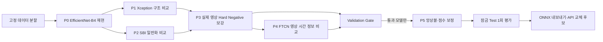

# 딥페이크 모델 고도화 실행 계획

## 한 줄 결론

현재 EfficientNet-B4를 버리고 새 모델 하나를 바로 채택하는 계획이 아니다. **같은 데이터 분할·같은 판정 기준·같은 지표**로 Xception, SBI, hard negative 보강, FTCN을 차례로 비교하고 실제 영상 오경고(FPR)를 1% 이하로 줄이는 것이 목표다.

> EfficientNet-B4와 Xception의 1차 비교는 완료됐다. 전체 성능과 속도는 EfficientNet-B4가 우세했고, Xception은 JPEG 압축 조건에서만 우세했다. SBI·Hard Negative·FTCN과 외부 검증은 아직 남아 있다.

## 왜 고도화가 필요한가?

현재 Celeb-DF-v2 공식 Test 결과는 전체 구분 능력인 AUC가 `0.999802`로 높고 딥페이크 Recall은 `100%`였다. 하지만 실제 영상을 딥페이크라고 잘못 경고한 FPR은 `1.6854%`로 목표 `1%`를 넘었다.

촬영 상태를 나쁘게 만들면 약점이 더 분명하다.

| 조건 | 현재 결과 | 쉬운 뜻 |
|---|---:|---|
| 깨끗한 공식 Test | FPR 1.6854% | 실제 영상 1,000개 중 약 17개를 잘못 경고 |
| 25% 축소 | FPR 12.92% | 작은 웹 영상에서 실제 영상을 자주 오인 |
| 흐림 | FPR 11.80% | 초점이 흐린 실제 영상에 취약 |
| 저조도 | Recall 78.24% | 어두운 딥페이크 약 22%를 놓침 |

따라서 다음 실험의 최우선 목표는 단순히 AUC 소수점을 높이는 것이 아니라 **실제 영상 오경고와 촬영 열화 약점을 줄이는 것**이다.

## 전체 파이프라인



### P0. 현재 모델을 다시 재현

- 현재 EfficientNet-B4 결과가 같은 코드·같은 분할에서 다시 나오는지 확인한다.
- 이 단계가 흔들리면 새 모델의 성능 향상인지 데이터 차이인지 구분할 수 없다.

### P1. Xception을 공정하게 비교

- 데이터, 얼굴 crop, seed, 학습 예산과 평가 방식은 유지한다.
- **모델 구조만** EfficientNet-B4에서 Xception으로 바꾼다.
- 더 좋아도 FPR·Recall·처리시간을 함께 보고 판단한다.
- Kaggle 비교를 완료했다. EfficientNet-B4가 열화 평균 ROC-AUC `0.998630`, p95 `69.35ms`로 Xception의 `0.998394`, `94.22ms`보다 좋았다.
- Xception은 JPEG q30 Validation ROC-AUC가 `0.999491`로 EfficientNet-B4의 `0.999122`보다 높았다. 그래서 전체 교체는 하지 않고 [Issue #35](https://github.com/Chunbae-A/face-image/issues/35)에서 JPEG 조건부 보조 모델만 검증한다.
- 자세한 실행과 결과는 [EfficientNet-B4·Xception 비교](xception-comparison.md)에 있다.

### P2. SBI로 보지 못한 조작 방식에 대비

- SBI(Self-Blended Images)는 실제 얼굴끼리 인공적인 조작 샘플을 만들어 학습한다.
- 특정 딥페이크 생성기의 흔적만 외우는 문제를 줄이는 후보로 비교한다.
- [SBI 공식 논문](https://openaccess.thecvf.com/content/CVPR2022/html/Shiohara_Detecting_Deepfakes_With_Self-Blended_Images_CVPR_2022_paper.html)과 [공식 코드](https://github.com/mapooon/SelfBlendedImages)의 연구·상업 이용 조건을 확인한 뒤 사용한다.

### P3. Hard negative로 실제 영상 오경고 보강

- Hard negative는 모델이 딥페이크라고 착각하기 쉬운 **진짜 영상**이다.
- 후보는 Validation의 실제 영상 오경고와 별도 외부 Validation에서만 찾는다.
- 공식 Test에서 틀린 영상을 다시 학습시키지 않는다. 그렇게 하면 시험 문제를 외우게 된다.
- 축소, 압축, 흐림, 저조도 실제 영상을 우선 보강한다.

### P4. FTCN으로 프레임 사이 움직임까지 사용

- 현재 모델은 얼굴 사진 한 장씩 점수를 낸 뒤 평균한다.
- FTCN은 여러 프레임 사이의 시간적 일관성을 사용하므로 영상에서만 보이는 부자연스러움을 잡을 가능성이 있다.
- 계산량이 더 크므로 이미지 모델 개선이 끝난 뒤 비교한다. [FTCN 공식 논문](https://openaccess.thecvf.com/content/ICCV2021/papers/Zheng_Exploring_Temporal_Coherence_for_More_General_Video_Face_Forgery_Detection_ICCV_2021_paper.pdf)

### P5. 검증을 통과한 모델만 조합

- 서로 다른 실수를 내는 두 모델의 점수를 조합했을 때만 앙상블 가치가 있다.
- Validation에서 단일 모델보다 좋아지지 않으면 복잡성만 늘어나므로 채택하지 않는다.
- 첫 소규모 실험은 JPEG 압축에서만 Xception을 실행하는 조건부 logit 결합이다. 학습 없이 효과와 지연을 먼저 측정하고, 이득이 확인된 경우에만 지식 증류 파인튜닝으로 빠른 단일 모델에 장점을 옮긴다.

## 데이터를 어떻게 늘리나?

데이터는 많다는 이유만으로 합치지 않는다. 각 데이터에는 역할과 이용 조건이 있다.

| 데이터 | 사용할 역할 | 상태 |
|---|---|---|
| Celeb-DF-v2 | 현재 기준선과 잠금 공식 Test | 승인·보유 완료 |
| [DFDC Preview](https://ai.meta.com/datasets/dfdc/) | 다른 촬영 환경의 실제 영상·외부 검증 | 약관 확인 후 소규모 사용 |
| [FaceForensics++](https://github.com/ondyari/FaceForensics) | 다른 조작 방식 교차 검증 | 공식 신청 필요 |
| [DeeperForensics-1.0](https://github.com/EndlessSora/DeeperForensics-1.0) | 압축·흐림·저조도 열화 검증 | 조건 확인 후 subset |
| [DF40](https://github.com/YZY-stack/DF40) | 다양한 최신 조작 방식의 외부 잠금 시험 | 비상업 조건 확인 후 subset |

원본 영상, 얼굴 crop, 개인별 점수, 체크포인트와 ONNX는 GitHub에 올리지 않는다. GitHub에는 식별자를 제거한 집계 지표와 그래프, 실행 설정, 모델 카드만 올린다.

## 모든 모델에 적용하는 공정한 규칙

1. 영상과 인물·원본 그룹을 먼저 Train/Validation/Test로 나눈다.
2. 그 뒤 프레임과 얼굴을 추출한다.
3. 모든 후보 모델은 같은 비공개 split manifest를 사용한다.
4. 1차 비교는 seed 1개로 비용을 줄이고, 결승 후보만 seed 3개로 반복한다.
5. 기준값과 모델 순위는 Validation에서만 정한다.
6. 공식 Test는 후보와 기준값을 모두 고정한 뒤 마지막에 한 번 확인한다.
7. 공식 Test 오류를 학습 데이터로 되돌리지 않는다.

설정은 [`configs/deepfake/model_improvement_plan.json`](../../configs/deepfake/model_improvement_plan.json)에 고정되어 있고 아래 명령으로 누수 방지 규칙을 검사한다.

```bash
python scripts/validate_deepfake_model_improvement_plan.py
```

## 합격 기준

다음은 업계 공통 인증 기준이 아니라 **딥소각 연구 후보를 고르는 내부 Gate**다.

| 항목 | 내부 목표 | 이유 |
|---|---:|---|
| 깨끗한 실제 영상 FPR | 1% 이하 | 현재 1.6854% 오경고를 먼저 줄임 |
| 깨끗한 딥페이크 Recall | 95% 이상 | FPR만 낮추려고 딥페이크를 놓치지 않게 제한 |
| 공식 Test 처리율 | 99% 이상 | 어려운 영상을 빼고 좋아 보이게 만드는 것을 방지 |
| 저조도 Recall | 연구 목표 85% 이상 | 현재 78.24% 약점을 직접 개선 |
| 열화 개선 조건 수 | 5개 중 최소 3개 | 특정 조건 하나만 좋아지는 모델을 배제 |
| 데이터 누수 | 0건 | 결과 신뢰성 보장 |

처리시간 p50·p95는 모든 실험에서 기록하지만, 실제 배포 장비 SLA가 정해지기 전에는 임의의 합격 시간을 만들지 않는다.

## Kaggle 무료 GPU에서 실행하는 순서

1. 현재 전처리 얼굴 crop 캐시와 split manifest를 Private Dataset으로 연결한다.
2. P0, P1, P2를 같은 노트북 인터페이스로 seed 1개씩 실행한다.
3. Validation 비교표를 만들고 하위 후보는 중단한다.
4. 상위 후보에 hard negative를 추가해 다시 학습한다.
5. 결승 후보만 seed 3개 반복과 FTCN 실험을 수행한다.
6. 후보·판정 기준을 고정한 후 공식 Test와 외부 잠금 subset을 평가한다.
7. Gate를 통과한 모델만 ONNX로 내보내 CPU API 스모크 테스트를 한다.

세션 종료에 대비해 전처리 캐시, checkpoint와 집계 결과는 Kaggle Private Output에 저장한다. 원본 데이터의 재배포가 허용되는지는 데이터별 약관을 별도로 확인한다.

## 결과표는 이렇게 작성한다

| 후보 | Clean FPR | Clean Recall | 저조도 Recall | 축소 FPR | 외부 AUC | p95 | 판정 |
|---|---:|---:|---:|---:|---:|---:|---|
| P0 EfficientNet-B4 | 1.6854% | 100% | 78.24% | 12.92% | 측정 전 | 측정 전 | 기준선 |
| P1 Xception | Validation 0% | 99.86% | 89.84% | 15.74% | 측정 전 | 94.22ms | 전체 교체 미채택 |
| P1b JPEG 조건부 결합 | 실행 전 | 실행 전 | 실행 전 | 실행 전 | 측정 전 | 실행 전 | 코드 준비 |
| P2 SBI | 실행 전 | 실행 전 | 실행 전 | 실행 전 | 실행 전 | 실행 전 | 미정 |
| P3 Hard negative | 실행 전 | 실행 전 | 실행 전 | 실행 전 | 실행 전 | 실행 전 | 미정 |
| P4 FTCN | 실행 전 | 실행 전 | 실행 전 | 실행 전 | 실행 전 | 실행 전 | 미정 |

## 보고서에서 강조할 모델링 판단

- AUC만 보고 성공이라고 하지 않고 실제 영상 오경고율을 별도 Gate로 잡았다.
- 같은 영상이나 인물이 Train과 Validation에 섞이는 데이터 누수를 막았다.
- 공식 Test로 모델을 고르지 않고 마지막 확인에만 사용한다.
- 한 데이터셋 점수만 높이는 대신 외부 조작 방식과 촬영 열화를 별도로 검증한다.
- 무료 GPU 예산을 고려해 모든 모델을 반복하지 않고 1차 선별 후 결승 후보만 3회 검증한다.
- 얼굴 원본과 모델 산출물은 비공개로 유지하고 GitHub에는 재현 가능한 코드와 집계 결과만 남긴다.
