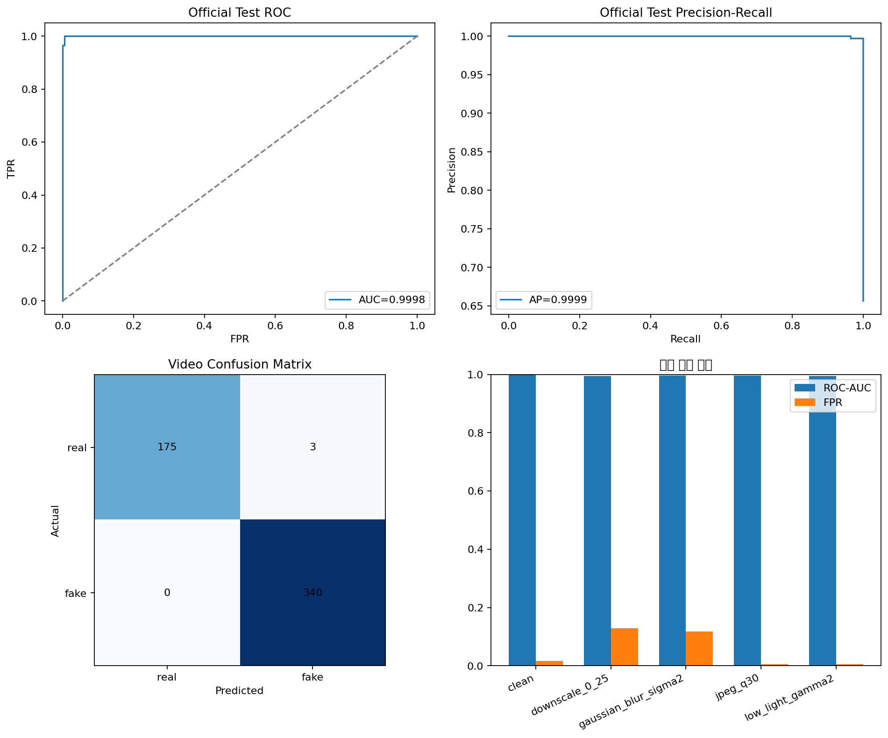

# Celeb-DF 전체 딥페이크 판별 기준선 최종 결과

## 결론

Celeb-DF-v2 전체 6,529개 영상으로 EfficientNet-B4 학습, 공식 Test 518개 평가, 촬영 열화 평가, ONNX 변환과 CPU 추론 시험을 완료했다.

- 공식 Test Video ROC-AUC: `0.999802`
- 딥페이크 Recall: `100%`
- 실제 영상 FPR: `1.685%`
- 연구 Gate: **미통과**
- ONNX Runtime CPU smoke: **통과**

AUC와 Recall은 높지만 실제 영상 178개 중 3개를 딥페이크로 잘못 경고했다. 목표 FPR 1% 이하를 넘었고 축소·흐림 영상에서는 오경고가 더 크게 증가하므로, 이 모델은 **연구 기준선**이며 즉시 경보·자동 차단·운영 API 모델로 승인하지 않는다.

## 단계별 완료 상태

| 단계 | 결과 | 상태 |
|---|---|---|
| 데이터 목록·라벨 검사 | 6,529개와 공식 Test 518개 확인 | 완료 |
| 영상 단위 분할·누수 검사 | 내부 Train/Validation 동일 영상·원본 대상 그룹 교집합 0 | 완료 |
| 전체 얼굴 전처리 | 6,528/6,529영상, 평가 manifest crop 208,893개 | 완료 |
| EfficientNet-B4 학습 | T4 x2, 요청 8 epoch 중 조기 종료 6 epoch | 완료 |
| 공식 Test·열화 평가 | 공식 Test 518개 전체 처리 | 완료 |
| ONNX 변환 | opset 17, 380×380 동적 batch | 완료 |
| CPU 추론 smoke | CPUExecutionProvider, 유한한 출력 확인 | 통과 |
| 연구 Gate | ROC-AUC 통과, FPR 실패 | 운영 미승인 |

## 데이터 구성

| 구분 | 전체 | 실제 | 딥페이크 | 사용 목적 |
|---|---:|---:|---:|---|
| Train | 5,175 | 604 | 4,571 | 모델 가중치 학습 |
| Validation | 836 | 108 | 728 | 프레임 수·통합 방식·기준값 선택 |
| 공식 Test | 518 | 178 | 340 | 선택 완료 후 최종 성능 확인 |
| 전체 | 6,529 | 890 | 5,639 |  |

프레임을 추출하기 전에 영상을 먼저 나눴다. 공식 Test는 학습·모델 선택·판정 기준 선택에 사용하지 않았다.

원본 ZIP 크기는 `9,952,957,051 bytes`이고 공식 Test 목록 SHA-256은 `07063d46206e011aef9d1ad8d1854f5b87ae519ba6e452b897cc528c3dcfcdc0`이다.

## 얼굴 전처리 결과

- 처리 성공: 6,528개 영상
- 제외: 1개 영상
- 제외 이유: `insufficient_valid_faces`
- 평가 manifest 얼굴 crop: 208,893개
- 전처리 시간: 약 1시간 26분
- 영상당 전처리 p50/p95: 약 `0.750초` / `0.827초`
- 전처리 Output: 약 3.017GB 비공개 TAR
- 비공개 TAR SHA-256: `37de3d9a84743b943c2e1b905c1e1e3862a0afa0738b5a94d87c78ce5295306e`

얼굴 crop, 파일명별 manifest와 원본 영상은 개인 식별 가능성이 있어 Kaggle Private Output으로만 유지하고 GitHub에 포함하지 않았다.

## 학습 설정

| 항목 | 값 |
|---|---|
| 모델 | torchvision EfficientNet-B4 |
| 시작 가중치 | ImageNet 사전학습 |
| 입력 크기 | 380×380 |
| 손실 | Binary cross entropy with logits |
| 클래스 균형 | 역빈도 WeightedRandomSampler |
| seed | 20260807 |
| batch / gradient accumulation | 8 / 2 |
| 요청/완료 epoch | 8 / 6 |
| 최고 Validation Video AUC | 1.0 |
| GPU | Tesla T4 |
| PyTorch / CUDA | 2.10.0 / 12.8 |

Validation에서 영상당 프레임 수, 프레임 점수 통합 방식과 판정 기준값을 정한 뒤 공식 Test에 고정 적용했다.

- 선택 프레임 수: 16
- 점수 통합: 평균
- 판정 기준값: `0.7519882694`

## 공식 Test 최종 결과

| 지표 | 결과 |
|---|---:|
| 평가 영상 | 518 |
| ROC-AUC | 0.9998017184 |
| Average Precision | 0.9998947903 |
| Accuracy | 0.9942084942 |
| Precision | 0.9912536443 |
| Recall | 1.0000000000 |
| F1 | 0.9956076135 |
| FPR | 0.0168539326 |
| FNR | 0.0000000000 |
| EER | 0.0057501652 |
| p50 / p95 프레임 추론 | 약 159.7ms / 161.2ms |

### 혼동행렬

| 실제\예측 | 실제 | 딥페이크 |
|---|---:|---:|
| 실제 영상 178개 | 175 | **3** |
| 딥페이크 340개 | 0 | **340** |

딥페이크 340개는 모두 찾았지만 실제 영상 3개를 잘못 경고했다. 실제 영상 10,000개로 환산하면 약 169개 오경고 수준이다.

초기 연구 Gate는 `ROC-AUC ≥ 0.90`, `FPR ≤ 0.01`이다. AUC Gate는 통과했지만 FPR Gate는 실패했다.

## 촬영 열화 결과

공식 Test와 같은 판정 기준값을 고정하고 입력만 열화했다.

| 조건 | ROC-AUC | Recall | FPR | FP | FN |
|---|---:|---:|---:|---:|---:|
| 원본 | 0.999802 | 100.00% | 1.69% | 3 | 0 |
| 해상도 25% 축소 | 0.995159 | 100.00% | **12.92%** | 23 | 0 |
| 가우시안 흐림 σ=2 | 0.996927 | 100.00% | **11.80%** | 21 | 0 |
| JPEG 품질 30 | 0.996910 | 94.41% | 0.56% | 1 | 19 |
| 저조도 gamma=2 | 0.995373 | **78.24%** | 0.56% | 1 | 74 |

- 축소·흐림은 실제 영상을 딥페이크라고 잘못 경고하는 문제가 커졌다.
- JPEG·저조도는 오경고는 줄었지만 딥페이크를 놓치는 비율이 증가했다.
- AUC만 보면 모두 높지만 고정 기준값에서의 실제 오류는 크게 달라진다.

따라서 실제 웹 후보에는 입력 품질 Gate, 열화 보정과 외부 데이터 검증 없이 사용하지 않는다.

## ONNX와 CPU 연결 시험

| 항목 | 결과 |
|---|---|
| ONNX 변환 | 완료 |
| opset | 17 |
| 입력 | `batch × 3 × 380 × 380` |
| 출력 | sigmoid 적용 전 `fake_logit` |
| ONNX Runtime provider | CPUExecutionProvider |
| 출력 유한값 검사 | 통과 |
| 단일 smoke 처리시간 | 약 171.0ms |
| 샘플 식별정보 보고서 포함 | 없음 |

`171ms`는 단일 연결 시험이며 API 응답시간 SLA가 아니다. 영상 API는 얼굴 검출, 프레임 추출, 여러 프레임 추론과 통합 시간을 별도로 측정해야 한다.

## 무결성 hash와 보관 정책

| 산출물 | SHA-256 | 공개 여부 |
|---|---|---|
| checkpoint | `adf8605655d56b02ec56cf75cc2d92d6da4eb93e7c27c1ed4dda5d1792d03dae` | 비공개 |
| ONNX | `c32a8532e2e1bd275b833b16460946eb307207098e0c07e2247851b71c23a6f1` | 비공개 |
| 비공개 모델 ZIP | `0f7be1668a864f31318b155588257992305672d2ca1733034ec36142530ba8d5` | 비공개 |
| 비식별 결과 ZIP | `4a7aa5dabdfbacde44492b207ec4e4fcdc13b7e6955029506dce457f0a171e2f` | 집계 파일만 공개 가능 |
| crop manifest | `2299f479a1e34fd3afe6f1827cff47bc1dec3ea1b09bf9aff6dade756c3a6702` | 비공개 |

두 ZIP은 다운로드 후 SHA-256 일치와 압축 무결성을 확인했다. 비공개 모델 ZIP은 Git 저장소 밖의 접근 제한 폴더에 보관하고 GitHub에는 올리지 않는다.

## 공개한 비식별 결과 파일

- [`inventory_aggregate.json`](inventory_aggregate.json): 데이터 수와 누수 집계
- [`preprocess_aggregate.json`](preprocess_aggregate.json): 전처리 성공·실패와 환경 집계
- [`train_aggregate.json`](train_aggregate.json): 학습 설정과 epoch별 집계
- [`aggregate_metrics.json`](aggregate_metrics.json): 공식 Test·열화 지표와 곡선
- [`onnx_export.json`](onnx_export.json): ONNX 규격과 hash
- [`onnx_cpu_smoke.json`](onnx_cpu_smoke.json): CPU 연결 시험
- [`MODEL_CARD.md`](MODEL_CARD.md): 연구용 모델 카드
- [`deepfake_baseline_summary.png`](deepfake_baseline_summary.png): 결과 그래프

이 파일들에는 원본 영상, 얼굴 crop, 파일명, 인물 ID, 개인별 점수와 로컬 경로가 없는 것을 검사했다.

## 데이터 누수 검사와 한계

| 검사 | 결과 |
|---|---:|
| Train/Validation 동일 영상 교집합 | 0 |
| Train/Validation 원본 대상 인물 그룹 교집합 | 0 |
| Train/Validation 합성 기증 인물 교집합 관측값 | 53 |
| Train/Test 동일 영상 교집합 | 0 |
| Validation/Test 동일 영상 교집합 | 0 |
| 공식 Test가 Test 밖으로 빠져나간 수 | 0 |

합성 파일명의 첫 번째 ID는 원본 대상, 두 번째 ID는 합성 기증 인물이다. 원본 대상과 영상 맥락은 내부 Train/Validation에서 분리했다. 기증 인물은 여러 대상 조합에 반복돼 53개가 겹치며 이를 데이터셋 한계로 공개한다.

공식 Test는 제작자가 고정한 목록이라 학습 후보와 원본 대상 인물 ID가 일부 겹친다. 같은 영상을 섞은 누수는 아니지만, 이 결과를 “완전히 처음 보는 인물만 평가했다”고 표현하지 않는다.

## 재실행 이력

| 실행 | 결과 | 조치 |
|---|---|---|
| 1차 | Kaggle torchvision과 Pillow 12 충돌 | Pillow 11.3으로 고정 |
| 2차 | P100용 CUDA 커널 미지원 | GPU T4 x2로 변경하고 사전검사 추가 |
| 3차 | 학습·평가 완료, ONNX 변환에서 `onnxscript` 누락 | 기존 ONNX 변환기로 고정 |
| 4차 | 학습·평가·ONNX·CPU smoke·결과 포장 | **전체 성공** |

## 다음 단계

Issue #15의 목표인 재현 가능한 전체 딥페이크 기준선은 완료했다. 성능 Gate 미통과도 기준선 결과로 인정하고 숨기지 않는다.

1. [Issue #16](https://github.com/Chunbae-A/face-image/issues/16)에서 품질 조건별 기준값·점수 보정과 화면용 신뢰도를 실험한다.
2. [Issue #17](https://github.com/Chunbae-A/face-image/issues/17)에서 ONNX를 연구용 비동기 분석 API에 연결한다.
3. 한국인·최신 생성 방식·실제 웹 재압축 영상으로 외부 검증한다.

실행 방법은 [`DEEPFAKE_KAGGLE_RUNBOOK.md`](../../../DEEPFAKE_KAGGLE_RUNBOOK.md), 전체 진행 기록은 [Issue #15](https://github.com/Chunbae-A/face-image/issues/15)에 있다.

## 개인정보·라이선스·해석 제한

- 원본 영상, 얼굴 crop, 영상·인물 ID별 점수, checkpoint와 ONNX는 GitHub에 포함하지 않는다.
- Kaggle Dataset, Notebook과 얼굴 crop Output은 Private로 유지한다.
- InsightFace 제공 얼굴 검출 가중치는 비상업 연구 조건으로 취급한다.
- 한국인, 최신 생성 방식, 실제 웹 재압축 영상에서 같은 성능을 보장하지 않는다.
- 이 결과 하나로 게시물 신고·삭제·복구를 자동 실행하지 않는다.
