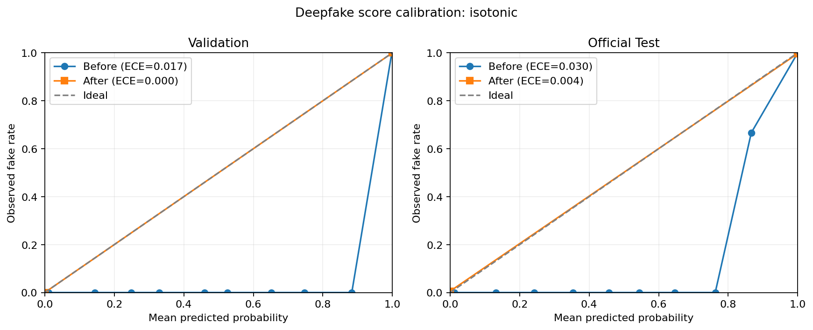

# 딥페이크 점수 보정 결과 — 2026-08-08

## 한 줄 결론

점수와 실제 가짜 비율의 차이인 ECE는 공식 Test에서 `0.02978 → 0.00386`으로 개선됐지만, 실제 영상 오경고율이 목표 `1%`보다 높은 `1.685%`여서 **화면 확률 표시는 승인하지 않았다.**

## 왜 이 실험을 했나?

딥페이크 모델이 낸 `0.84`는 그 자체로 “84% 확률”이 아니다. 비슷한 점수대에서 실제로 가짜였던 비율과 모델 숫자를 맞추는 보정이 필요하다. 이번 실험은 Temperature Scaling, Platt Scaling, Isotonic Calibration을 Validation에서 비교하고, 선택을 마친 뒤 공식 Test에서 한 번만 최종 확인했다.

## 실행 정보

| 항목 | 값 |
|---|---:|
| 실행 환경 | Private Kaggle Notebook, GPU T4 x2 |
| Kaggle 버전 | Version 1 |
| 실제 실행시간 | 293.8초(약 4분 54초) |
| Validation | 836개 영상 |
| 공식 Test | 518개 영상 — 실제 178개, 가짜 340개 |
| 영상 점수 | 영상당 대표 얼굴 최대 16프레임의 sigmoid 원점수 평균 |
| 선택 방법 | Isotonic Calibration |
| 선택에 공식 Test 사용 | 0건 |

재현 Notebook: [deepsogak-score-calibration Version 1](https://www.kaggle.com/code/hywznn/deepsogak-score-calibration)

## 보정 전후

낮을수록 좋은 지표다.

| 분할 | 지표 | 보정 전 | 보정 후 |
|---|---|---:|---:|
| Validation | ECE | 0.017398 | 0.0000001 |
| Validation | Brier | 0.007034 | 0.0000000 |
| 공식 Test | ECE | 0.029784 | 0.003861 |
| 공식 Test | Brier | 0.013203 | 0.003861 |
| 공식 Test | NLL | 0.049878 | 0.062232 |

ECE와 Brier는 개선됐지만 공식 Test NLL은 오히려 나빠졌다. 선택된 Isotonic 모델이 Validation에서 점수를 거의 `0` 또는 `1`로 나누기 때문에, 틀린 사례에 매우 확신하는 문제가 남는다. 따라서 ECE만 보고 운영 승인하지 않았다.

## 판정 성능과 Gate

기준값 `0.7519882694`를 적용한 공식 Test 결과다.

| 지표 | 결과 | 목표 | 판정 |
|---|---:|---:|---|
| ROC-AUC | 0.999802 | 참고 | 매우 높은 구분력 |
| Recall | 1.000000 | 참고 | 가짜 340개를 모두 탐지 |
| 실제영상 FPR | 0.016854 | 0.010000 이하 | **실패** |
| 공식 Test ECE | 0.003861 | 0.050000 이하 | 통과 |
| 전체 Gate | 실패 | 모두 통과 | **운영 미승인** |

실제 영상 178개 중 3개를 가짜로 잘못 경고했다. 약 1,000개의 실제 영상에 같은 비율이 유지된다고 단순 환산하면 약 17개를 잘못 경고하는 수준이다. 목표는 최대 10개이므로 즉시 경보 또는 자동 신고에 사용할 수 없다.

## API와 화면에 반영하는 규칙

- `raw_score`: 모델이 낸 원점수로 제공하지만 확률이라고 부르지 않는다.
- `calibrated_probability`: 이번 Gate가 실패했으므로 항상 `null`이다.
- `calibration_status`: `research_only_unapproved`다.
- `risk_level`: Validation에서 정한 연구용 검토 구간일 뿐 피해 확정값이 아니다.
- 자동 신고·삭제는 하지 않고 사람이 원본, 출처, 영상 구간을 확인한다.

API에 설치할 때는 같은 디렉터리의 [`deepfake_video_calibration.json`](deepfake_video_calibration.json)을 `.models/deepfake/deepfake_video_calibration.json`으로 복사한다. 이 파일은 `display_approved=false`이므로 설치해도 확률 숫자는 열리지 않는다.

## 개인정보와 재현성

- GitHub 결과에는 영상 ID, 프레임 점수, 얼굴 crop, 임베딩, 원본 영상이 없다.
- 모델·원본 데이터·프레임별 점수는 비공개로 유지한다.
- 보정값 선택에는 Validation만 사용했고 공식 Test는 최종 평가에만 사용했다.
- 이 결과는 Celeb-DF-v2 내부 검증이며 한국인·최신 생성 방식·실제 웹 재압축 환경을 보장하지 않는다.
