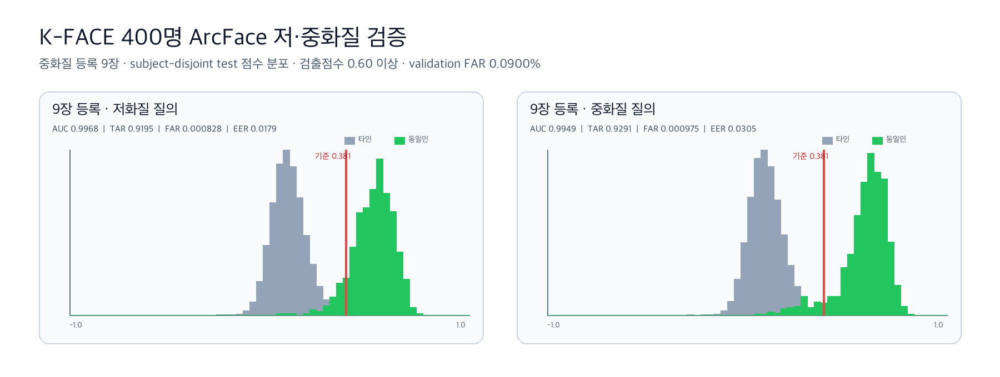

# K-FACE 400명 얼굴가드 적응형 검출·품질 Gate 검증

## 한 줄 결론

Mac에서 저·중화질 얼굴 검출 실패분만 `960 → 1280` 입력 크기로 다시
처리하고, **검출점수 0.60 이상인 중화질 프레임 9장**으로 등록 중심을 만든
결과 subject-disjoint test에서 저·중화질 모두 연구 목표
`TAR ≥ 90%`, `FAR ≤ 0.1%`를 처음 통과했다.

이 결과는 K-FACE 통제 촬영 데이터의 **연구 후보**다. 현재 서비스 API의
운영 기준값을 교체하거나 본인인증·자동 피해 판정에 사용할 근거는 아니다.



## 무엇을 바꿨는가

기존 v3는 SCRFD 입력 크기 `640`, 최소 검출점수 `0.60`으로 각 인물의
저·중화질 이미지 15장을 처리했다. 이번 v3.1은 기존 성공 결과를 그대로
유지하고 **실패한 이미지만** 다음 순서로 다시 시도했다.

1. SCRFD 입력 크기 `960`, 최소 검출점수 `0.50`
2. 960에서도 실패했을 때만 입력 크기 `1280`, 최소 검출점수 `0.50`
3. 그래도 얼굴을 찾지 못하거나 얼굴이 너무 작으면 분석 불가로 유지
4. 재탐지 결과 중 검출점수 `0.60` 미만은 자동 동일인 판정에서 제외

원본 ZIP은 Mac의 비공개 폴더에서만 읽었다. 압축 해제 얼굴, 원본 경로,
인물 식별자, 개별 임베딩은 GitHub 결과에 포함하지 않았다.

## 얼굴 검출 복구 결과

| 항목 | 저화질 | 중화질 |
|---|---:|---:|
| 대상 인물 | 400명 | 400명 |
| 선택 이미지 | 6,000장 | 6,000장 |
| 기존 성공 | 4,732장 (78.87%) | 5,307장 (88.45%) |
| 추가 복구 | **467장** | **218장** |
| 최종 성공 | **5,199장 (86.65%)** | **5,525장 (92.08%)** |
| 기존 실패 중 복구율 | 36.83% | 31.46% |
| 최종 분석 불가 | 801장 | 475장 |

- 저화질 복구 467장 중 455장(97.43%)은 `960` 단계에서 복구됐다.
- 중화질 복구 218장 중 212장(97.25%)은 `960` 단계에서 복구됐다.
- `1280` 단계의 추가 복구는 저화질 12장, 중화질 6장뿐이었다.
- 전체 재처리 시간은 CPU에서 약 17분 57초였다.

따라서 실제 API에 재시도를 도입할 경우 `640 → 960`을 기본 적응형 경로로
두고, `1280`은 비용 대비 효과가 낮은 선택 경로로 보는 것이 합리적이다.

## 왜 복구 이미지를 모두 자동 판정에 쓰지 않았는가

복구 이미지를 품질 제한 없이 5장 등록 평가에 모두 포함하면 분석 가능한
질의는 늘지만 어려운 얼굴도 함께 들어온다. 그 결과 FAR은 목표 안으로
내려왔지만 저화질 TAR이 더 낮아졌다.

| 5장 등록 Test | 저화질 | 중화질 |
|---|---:|---:|
| 기존 v3 TAR | 87.74% | 95.58% |
| 기존 v3 FAR | 0.1201% | 0.1132% |
| v3.1 복구 전체 TAR | 86.06% | 93.64% |
| v3.1 복구 전체 FAR | 0.0955% | 0.0975% |

즉, “얼굴을 찾았다”와 “자동 동일인 판정에 충분히 선명하다”는 같은 뜻이
아니다. 검출점수 `0.60` 미만의 복구 입력은 후보를 놓치지 않기 위한
**사용자 검토 경로**로 보내고 자동 확정에서는 제외했다.

## 최종 품질 Gate 프로토콜

1. 400명을 seed `20260815`로 validation 200명과 test 200명으로 분리했다.
2. 등록과 질의 모두 SCRFD 검출점수 `0.60` 이상만 자동 판정에 사용했다.
3. 중화질 등록 프레임 9장의 ArcFace 임베딩을 평균했다.
4. 등록에 쓴 촬영 위치는 저·중화질 질의에서 모두 제외했다.
5. validation의 FAR 선택 목표는 운영 목표 0.1%보다 엄격한 **0.09%**로
   두어 데이터 이동에 대비한 안전 여유를 만들었다.
6. validation에서 정한 기준값 `0.381351`을 test에 변경 없이 적용했다.

### Subject-disjoint test 결과

| 지표 | 저화질 질의 | 중화질 질의 | 목표 |
|---|---:|---:|---:|
| test 인물 | 200명 | 200명 | 인물 분리 |
| 본인 질의 | 783건 | 917건 | - |
| 타인 비교 | 155,817건 | 182,483건 | - |
| ROC-AUC | 0.996807 | 0.994862 | 참고 지표 |
| EER | 1.79% | 3.05% | 참고 지표 |
| TAR | **91.95%** | **92.91%** | 90% 이상 |
| FAR | **0.0828%** | **0.0975%** | 0.1% 이하 |
| Gate | **통과** | **통과** | 두 화질 모두 통과 |

TAR과 FAR은 비율 지표이고 유사도 `0.381351`은 확률이나 신뢰도가 아니다.

## 서비스에 적용한다면

사진 파일 9장을 사용자가 직접 고르게 하는 방식은 부담이 크다. 시연·후속
개발에서는 **2~3초 얼굴 등록 촬영 → 품질이 좋은 프레임 9장 자동 선택**으로
구현하는 편이 적합하다.

```text
짧은 등록 촬영
  → SCRFD 640 검출
  → 실패 프레임만 960 재검출
  → 검출점수 0.60 이상 9장 선택
  → ArcFace 평균 임베딩 저장
  → 웹 후보 얼굴 비교
  → 낮은 품질은 사용자 검토, 높은 품질만 자동 점수화
```

현재 API는 최대 등록 사진 5장으로 설계돼 있고 기존 연구 기준값을 사용한다.
따라서 이번 9장 프로토콜은 **API에 아직 연결하지 않았다**. 실제 웹·SNS
재압축 이미지와 동의받은 모바일 촬영 데이터에서 같은 Gate를 재검증한 뒤
API 변경 여부를 결정해야 한다.

## 한계와 다음 작업

- K-FACE는 통제 촬영 데이터라 실제 공개 웹 검색 이미지를 완전히 대표하지 않는다.
- seed 1개 결과라 인물 단위 bootstrap 95% 신뢰구간과 반복 seed가 필요하다.
- 9장 등록은 현재 5장 UX보다 부담이 크므로 짧은 burst 촬영 구현이 필요하다.
- 사전학습 `buffalo_l` 평가이며 K-FACE로 ArcFace를 파인튜닝한 결과가 아니다.
- InsightFace 제공 가중치는 비상업 연구 조건으로만 사용했다.
- 다음 우선순위는 Google Vision Web Detection 후보에서 같은 품질 Gate와
  ArcFace 기준값을 외부 검증하는 것이다.

## 재현 자료

- [집계 JSON](kface_adaptive_quality_gate.json)
- [점수 분포 그래프](kface_adaptive_quality_gate.png)
- 재탐지·중단 재개: [`scripts/kface_pilot.py`](../../../scripts/kface_pilot.py)
- 품질 Gate 평가: [`scripts/evaluate_kface_verification.py`](../../../scripts/evaluate_kface_verification.py)
- 그래프: [`scripts/plot_kface_verification.py`](../../../scripts/plot_kface_verification.py)
