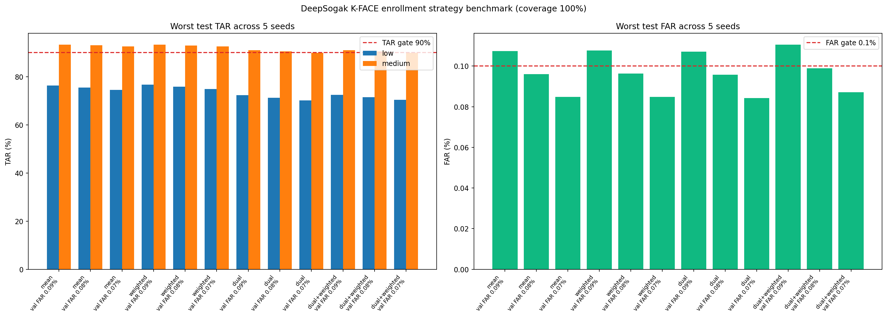

# K-FACE 400명 등록 5장 결합 전략 비교

## 한 줄 결론

등록 사진 5장의 품질 가중 평균은 저화질 본인 통과율(TAR)을 약
`+0.28~0.30%p` 높였지만 개선폭이 작았다. 두 개 등록 중심을 사용한
방식은 오히려 성능이 낮아졌다. **TAR 90% 이상·FAR 0.1% 이하를 5번
반복에서 모두 만족한 전략은 없었다.**

현재 API의 단순 평균 등록 방식·판정 기준값·`research_only_unapproved`를
변경하지 않는다.

## 왜 이 실험을 했나

이전 품질 Gate 실험에서 낮은 품질 사진을 거절하면 TAR은 높아졌지만,
저화질 자동 처리 비율이 최소 `30.62%`까지 낮아졌다. 사진 10장 중
약 7장에 재촬영을 요청하는 방식은 실제 사용이 어렵다.

이번에는 확인 사진을 추가로 버리지 않고 **등록 사진 5장을 하나의
비교 기준으로 만드는 방식**만 바꿔 성능을 비교했다. 따라서 모든 전략의
자동 처리 coverage는 `100%`다.

## 비교한 등록 방식

| 전략 | 쉽게 설명 |
|---|---|
| 단순 평균 | 현재 API처럼 ArcFace 특징 5개를 같은 비중으로 평균 |
| 품질 가중 평균 | 검출점수·얼굴 픽셀 크기·밝기가 좋은 등록 사진에 더 큰 비중 |
| 등록 중심 2개 | 서로 가장 다른 등록 사진을 시작점으로 두 모습을 별도 보존 |
| 중심 2개 + 품질 가중 | 두 중심의 각 그룹 안에서 품질 가중 평균 |

품질 가중은 세 지표를 각각 `0.25~1.0`으로 제한한 뒤 기하평균했다.
실제 등록 사진에 부여된 가중치는 `0.3563~0.9370`, 중앙값은
`0.6195`였다.

## 실험 설계

| 항목 | 내용 |
|---|---|
| 데이터 | AI-Hub 승인 K-FACE 400명 저·중화질 전체 특징값 |
| 입력 | ArcFace 512차원 특징값 16.085GB, 8,800 chunk |
| 등록 | 중화질 5장, 검출점수 0.60 이상 |
| 확인 사진 | 저·중화질, 검출점수 0.60 이상, 추가 품질 거절 없음 |
| 누수 방지 | 등록에 쓴 이미지를 질의에서 제외, 인물 단위 validation/test 분리 |
| 반복 | seed 5개 |
| validation FAR 선택 목표 | 0.09%·0.08%·0.07% |
| 최종 연구 Gate | test TAR 90% 이상, FAR 0.1% 이하 |
| coverage | 모든 전략 100% |
| 실행 | Private Kaggle Dataset, Tesla T4, CUDA, 약 4.10분 |

이 데이터 내에서 전략을 비교하고 반복 test 지표로 후보를 평가했다.
따라서 향후 후보가 통과해도 **실제 웹·모바일의 잠긴 외부 test**를
추가로 통과해야 API에 적용할 수 있다.

## 전체 결과

아래는 5번 반복 중 가장 나쁜 test TAR과 가장 높은 test FAR이다.

| 등록 전략 | validation FAR | 저화질 TAR | 중화질 TAR | 최악 FAR | 판정 |
|---|---:|---:|---:|---:|---|
| 단순 평균 | 0.09% | 76.35% | 93.35% | 0.1073% | TAR·FAR 미통과 |
| 단순 평균 | 0.08% | 75.49% | 92.99% | **0.0960%** | 저화질 TAR 미통과 |
| 단순 평균 | 0.07% | 74.56% | 92.58% | **0.0848%** | 저화질 TAR 미통과 |
| 품질 가중 평균 | 0.09% | **76.62%** | 93.26% | 0.1076% | TAR·FAR 미통과 |
| 품질 가중 평균 | 0.08% | **75.80%** | 92.91% | **0.0963%** | 저화질 TAR 미통과 |
| 품질 가중 평균 | 0.07% | **74.86%** | 92.50% | **0.0848%** | 저화질 TAR 미통과 |
| 중심 2개 | 0.09% | 72.26% | 90.98% | 0.1070% | TAR·FAR 미통과 |
| 중심 2개 | 0.08% | 71.27% | 90.49% | **0.0957%** | 저화질 TAR 미통과 |
| 중심 2개 | 0.07% | 70.11% | 89.91% | **0.0842%** | TAR 미통과 |
| 중심 2개 + 품질 | 0.09% | 72.47% | 91.00% | 0.1106% | TAR·FAR 미통과 |
| 중심 2개 + 품질 | 0.08% | 71.49% | 90.52% | **0.0989%** | 저화질 TAR 미통과 |
| 중심 2개 + 품질 | 0.07% | 70.37% | 89.95% | **0.0871%** | TAR 미통과 |

## 어떻게 해석해야 하나

### 1. 품질 가중 평균은 방향은 맞지만 개선폭이 작다

validation FAR 0.09%에서 저화질 TAR이 `76.35% → 76.62%` `+0.28%p`,
FAR을 통과한 0.08% 조건에서는 `75.49% → 75.80%` `+0.30%p`
올랐다. 하지만 실험 계획의 최소 의미 있는 개선폭 `+2%p`보다 훨씬
작고, 중화질 TAR은 약 `0.08~0.09%p` 낮아졌다.

### 2. 중심 2개는 이번 설계에서 사용하지 않는다

질의와 두 중심의 유사도 중 큰 값을 사용하면 본인 점수뿐 아니라 타인
점수도 함께 올랐다. FAR을 맞추기 위해 판정 기준값이 더 엄격해졌고,
결과적으로 저화질 TAR이 단순 평균보다 약 `4%p` 낮아졌다.

### 3. 안전 여유로 FAR은 맞출 수 있지만 저화질 정보를 복구하지는 못한다

validation FAR을 0.09%에서 0.08%로 엄격하게 선택하면 단순 평균과 품질
가중 평균의 test FAR은 각각 `0.0960%`, `0.0963%`로 목표를 통과했다.
하지만 기준값을 높이면 본인도 더 많이 탈락하므로 저화질 TAR은 76%보다
더 낮아졌다. 이는 기준값 문제보다 **저해상도 얼굴 특징 자체의 정보
손실**이 핵심 문제임을 보여준다.

## API 결정

- 단순 평균을 품질 가중 평균으로 교체하지 않는다.
- 중심 2개 비교를 API에 추가하지 않는다.
- K-FACE 연구 기준값으로 API 판정 기준값을 변경하지 않는다.
- `threshold_status=research_only_unapproved`를 유지한다.
- 클라이언트 코드는 변경하지 않는다.

## 다음 모델링

다음 실험은 특징을 평균하는 규칙이 아니라 실제로 학습하는 **저화질
임베딩 보정 어댑터**다.

1. 저화질 ArcFace 512차원 특징을 입력한다.
2. 같은 촬영의 중화질 특징에 가깝게 만드는 작은 residual MLP를 학습한다.
3. 학습·validation·test 인물을 완전히 분리한다.
4. 원본 ArcFace와 보정 ArcFace를 같은 등록 5장·TAR·FAR로 비교한다.
5. 개선폭이 `+2%p` 미만이거나 FAR 0.1%를 넘으면 제품 후보로 선택하지
   않는다.
6. 통과하면 ONNX로 변환한 뒤, 얼굴 픽셀 크기가 작은 질의에만 적용하는
   API 후보를 별도 검증한다.

이 방식은 원본 얼굴 사진을 생성하지 않으므로, 초해상화 모델이 얼굴을
환각하는 위험보다 작다. 그래도 반드시 인물 단위 잠긴 test로 검증한다.

## 재현 자료

- Kaggle Notebook: [k-face-enrollment-strategy-benchmark](https://www.kaggle.com/code/hywznn/k-face-enrollment-strategy-benchmark)
- 집계 JSON: [`kface_enrollment_strategy_benchmark.json`](kface_enrollment_strategy_benchmark.json)
- 그래프: [`kface_enrollment_strategy_benchmark.png`](kface_enrollment_strategy_benchmark.png)
- Kaggle 실행 로그: [`k-face-enrollment-strategy-benchmark.log`](k-face-enrollment-strategy-benchmark.log)
- 분석 코드: [`scripts/analyze_kface_enrollment_strategies.py`](../../../scripts/analyze_kface_enrollment_strategies.py)
- Notebook 생성기: [`scripts/build_kface_enrollment_strategy_kaggle_notebook.py`](../../../scripts/build_kface_enrollment_strategy_kaggle_notebook.py)

원본 얼굴·임베딩·인물 ID·개별 유사도는 Kaggle Output·GitHub에 저장하지
않았다. 집계 JSON, 그래프와 실행 로그만 남겼다.
