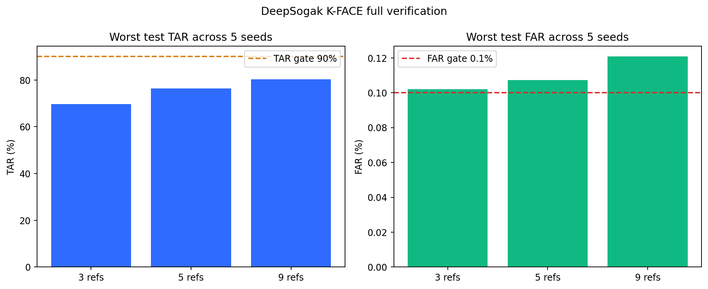

# K-FACE 400명 전체 얼굴가드 반복 검증

## 한 줄 결론

K-FACE 저·중화질 **864만 장 전체**에서 등록 사진 3장·5장·9장을 5번
반복 검증했다. 등록 9장이 가장 좋았지만 저화질 본인 통과율이 최소
`80.36%`였고, 최악의 타인 오통과율도 `0.1207%`로 목표 `0.1%`를
넘었다. 따라서 새 기준값 `0.3862`는 연구 후보로만 기록하고 현재 API에는
적용하지 않는다.

## 왜 이 실험을 했나

기존 12,000장 표본 실험은 빠르게 방향을 잡는 데 유용했지만, 전체 촬영
조건과 여러 데이터 분할에서도 같은 성능이 나오는지는 증명하지 못했다.
이번 실험은 다음 질문에 답한다.

> 한국인 얼굴 전체 조건에서 등록 사진 수를 늘리면, 본인은 잘 찾으면서
> 다른 사람을 나로 잘못 통과시키는 비율을 0.1% 이하로 유지할 수 있는가?

이것은 **동일인 얼굴 비교 모델의 평가·기준값 보정**이다. K-FACE는 실제
얼굴 데이터이므로 이 결과를 딥페이크 조작 탐지 성능으로 해석하지 않는다.

## 사용한 데이터

| 항목 | 값 |
|---|---:|
| 인물 | 400명 |
| 원본 저·중화질 이미지 | 8,640,000장 |
| 저·중화질 쌍 | 4,320,000쌍 |
| 얼굴 특징 추출 성공 | 7,749,710장, 3,874,855쌍 |
| 얼굴 특징 추출 제외 | 890,290장 |
| 익명화 특징값 파일 | 8,800개 |
| 특징값 크기 | 16,084,514,540 bytes |

- 실제 이름 대신 해시로 만든 내부 인물 ID만 사용했다.
- Kaggle에는 원본 얼굴이 아닌 ArcFace 512차원 특징값만 비공개로 올렸다.
- 결과에는 원본 경로, 인물 ID, 개별 특징값, 개별 비교 점수를 남기지 않았다.

## 어떻게 검증했나

1. 중화질 특징 3장·5장·9장을 평균해 각 사람의 등록 기준 얼굴을 만들었다.
2. 등록에 쓴 촬영 위치는 저·중화질 확인 사진에서 제외했다.
3. 400명을 validation 200명과 test 200명으로 인물 단위 분리했다.
4. seed `20260815`~`20260819`로 분리를 5번 바꿔 반복했다.
5. 얼굴 검출점수 `0.60` 이상만 자동 판정에 사용했다.
6. validation에서 FAR `0.09%`를 목표로 기준값을 정하고, 보지 않았던
   test에서 TAR `90% 이상`과 FAR `0.1% 이하`를 확인했다.
7. 수십억 건의 타인 비교는 개별 저장하지 않고 40,000칸 histogram에
   누적했다.

쉬운 뜻은 다음과 같다.

- **TAR**: 실제 본인을 본인으로 통과시킨 비율. 높을수록 좋다.
- **FAR**: 다른 사람을 본인으로 잘못 통과시킨 비율. 낮을수록 좋다.
- **기준값**: 얼굴 유사도가 이 숫자 이상일 때 같은 사람 후보로 보는 경계다.

## 최종 결과

아래 값은 5번 반복 중 가장 나빴던 test 결과다. FAR은 저·중화질 중 더
나쁜 값을 사용했다.

| 등록 수 | 보수적 기준값 후보 | 저화질 TAR | 중화질 TAR | 최악 FAR | 연구 Gate |
|---:|---:|---:|---:|---:|---|
| 3장 | `0.37775` | 69.65% | 88.88% | 0.1021% | 미통과 |
| 5장 | `0.37840` | 76.35% | 93.35% | 0.1073% | 미통과 |
| 9장 | `0.38620` | **80.36%** | **95.22%** | 0.1207% | 미통과 |

### 결과 해석

- 등록 수를 3장에서 9장으로 늘리면 본인 통과율은 확실히 좋아졌다.
- 중화질은 9장 등록에서 최소 95.22%로 좋았지만 저화질은 80.36%에
  머물렀다. 전체 실패의 가장 큰 원인은 저화질이다.
- 엄격한 기준값은 타인 오통과를 줄이지만 저화질 본인도 많이 거절한다.
- 12,000장 표본 v3.1 실험의 Gate 통과는 방향 탐색 결과였고, 864만 장
  전체·5회 반복 결과는 더 보수적인 운영 판단 근거다.

## API 적용 결정

이번 결과로 API 값을 자동 변경하지 않는다.

- 현재 API 기준값 `0.2823836207389832`는 그대로 두고
  `threshold_status=research_only_unapproved`를 유지한다.
- `0.3862`는 9장 등록 연구 후보이며 확률이나 승인된 운영 기준값이 아니다.
- 현재 API 계약은 최대 5장·3장 권장이므로 9장으로 즉시 변경하지 않는다.
- 장기적으로는 사용자가 9개 파일을 고르게 하지 않고 짧은 촬영에서 좋은
  얼굴 프레임을 자동 선택하는 등록 방식을 검토한다.
- 실제 공개 웹 이미지와 동의받은 모바일 촬영 이미지의 외부 검증 전에는
  계정 승인·자동 신고·자동 차단에 사용하지 않는다.

## 실행과 재현

- 실행 환경: Kaggle Private Notebook, Tesla T4, CUDA
- 핵심 평가 시간: `227.89초`, 약 3분 48초
- [비공개 Kaggle Notebook](https://www.kaggle.com/code/hywznn/k-face-400)
- [비공개 Kaggle Dataset](https://www.kaggle.com/datasets/hywznn/deepsogak-kface-arcface-private-2026-08-17)
- 평가 코드: `scripts/evaluate_kface_full_embeddings.py`
- 노트북 생성 코드: `scripts/build_kface_full_kaggle_notebook.py`
- 실행 노트북: `notebooks/kaggle/kface_full_verification/notebook.ipynb`
- [전체 집계 JSON](kface_full_verification.json)
- [결과 그래프](kface_full_verification.png)
- [Kaggle 실행 로그](k-face-400.log)

## 다음 작업

1. 저화질 실패를 각도·조명·표정·가림 조건별로 분리해 원인을 수치화한다.
2. 검출 품질이 낮으면 억지 판정하지 않고 재촬영을 요청하는 품질 Gate를
   API 응답에 연결한다.
3. 짧은 등록 영상에서 서로 다른 좋은 프레임 5장 이내를 자동 선택해 현재
   API 계약 안에서 성능을 다시 확인한다.
4. 공개 웹 재압축 이미지와 동의받은 모바일 이미지로 외부 검증한다.

