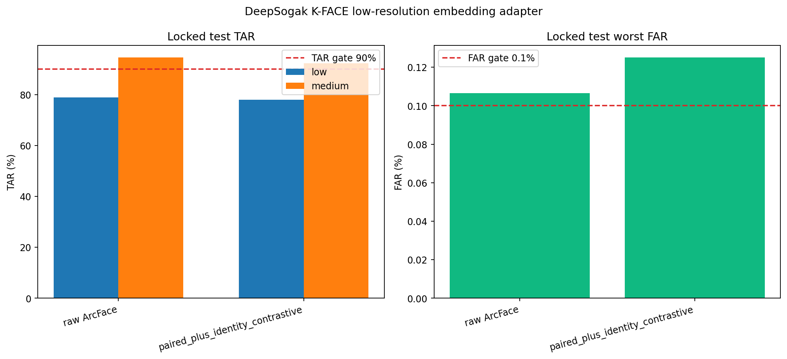

# K-FACE 저화질 얼굴 특징 보정 모델 실험

## 한 줄 결론

저화질 얼굴 특징을 중화질 특징에 가깝게 바꾸는 작은 신경망을 실제로
학습했지만, **저화질 본인 통과율과 타인 구분 성능이 모두 나빠져 채택하지
않았다.** 따라서 ONNX 모델을 만들지 않았고 기존 얼굴가드 API도 변경하지
않았다.



## 무엇을 시험했나

ArcFace는 얼굴 한 장을 512개의 숫자, 즉 얼굴 특징값으로 바꾼다. 저화질
사진은 이 특징값의 정보가 일부 손상돼 같은 사람끼리도 점수가 낮아질 수
있다. 이번 실험에서는 같은 촬영의 저화질·중화질 특징값 쌍을 이용해 다음
변환을 학습했다.

```text
저화질 ArcFace 특징 512개
        ↓
작은 residual MLP (512 → 128 → 512)
        ↓
중화질 ArcFace 특징에 가까운 보정 특징
        ↓
등록 사진 5장의 평균 특징과 코사인 유사도 비교
```

원본 ArcFace와 아래 두 후보를 Validation에서만 비교했다.

1. 같은 촬영의 저화질·중화질 특징을 가깝게 만드는 후보
2. 위 학습에 같은 인물은 가깝게, 다른 인물은 멀게 만드는 대조 손실을
   추가한 후보

두 번째 후보가 Validation 저화질 TAR이 더 높아 선택됐고, 선택이 끝난
뒤에만 잠가 둔 Test를 한 번 평가했다.

## 데이터와 누수 방지

| 구분 | 인원 | 용도 |
|---|---:|---|
| Train | 240명 | 모델 가중치 학습 |
| Validation | 80명 | 후보 모델·판정 기준값 선택 |
| 잠긴 Test | 80명 | 선택 완료 후 최종 확인 1회 |
| 전체 | **400명** | AI-Hub 승인 K-FACE 저·중화질 특징값 |

- 인물 단위로 나눠 Train·Validation·Test 중복은 `0명`이다.
- 학습에는 검출 점수 `0.60` 이상인 저화질·중화질 쌍 `1,848,767개`를
  사용했다.
- Tesla T4에서 1 epoch, 8,792 batch를 학습했고 학습 시간은 약
  `148초`, 전체 실행은 약 `4.1분`이었다.
- Test 결과는 후보 선택이나 학습에 사용하지 않았다.

## 잠긴 Test 결과

TAR은 본인을 본인으로 통과시킨 비율이고, FAR은 다른 사람을 본인으로
잘못 통과시킨 비율이다. 목표는 저·중화질 TAR `90% 이상`, 최악 FAR
`0.1% 이하`다.

| 방법 | 저화질 TAR | 중화질 TAR | 최악 FAR | 저화질 ROC-AUC | 판정 |
|---|---:|---:|---:|---:|---|
| 원본 ArcFace | **79.01%** | **94.61%** | 0.1065% | **0.9908** | FAR·저화질 TAR 미통과 |
| 보정 모델 | 78.05% | 92.34% | 0.1250% | 0.9890 | **채택 안 함** |

보정 모델은 원본보다 저화질 TAR이 `-0.96%p`, 중화질 TAR이
`-2.27%p` 낮아졌다. 최악 FAR도 `0.1065% → 0.1250%`로 높아졌다.

## 왜 나빠졌나

잠긴 Test 저화질에서 평균 점수의 변화를 보면 원인을 이해할 수 있다.

| 점수 종류 | 원본 ArcFace | 보정 모델 | 변화 |
|---|---:|---:|---:|
| 같은 사람 평균 유사도 | 0.456 | 0.469 | +0.013 |
| 다른 사람 평균 유사도 | 0.087 | 0.120 | **+0.034** |

같은 사람 점수도 조금 올랐지만 다른 사람 점수가 더 크게 올랐다. 즉 모델이
저화질 특징을 중화질 쪽으로 옮기는 동안 여러 사람의 특징을 서로 비슷하게
모아 버려 구분력이 떨어졌다.

중화질 특징 자체에는 보정 모델을 적용하지 않았다. 다만 저화질의 높아진
타인 점수를 막기 위해 공통 판정 기준값이 `0.36545 → 0.39000`으로
높아졌고, 그 결과 중화질 본인도 더 많이 탈락해 중화질 TAR이 낮아졌다.

## 사전에 정한 개선 Gate

| 조건 | 목표 | 실제 | 결과 |
|---|---:|---:|---|
| 저화질 TAR 개선 | +2.00%p 이상 | **-0.96%p** | 실패 |
| 중화질 TAR 하락 | 1.00%p 이하 | **2.27%p** | 실패 |
| 최악 FAR | 0.1000% 이하 | **0.1250%** | 실패 |

세 조건을 모두 통과해야 모델 파일을 내보내도록 만들었다. 이번에는 통과하지
못했으므로 비공개 ONNX도 생성하지 않았다. 실패한 모델을 데모 API에 억지로
넣어 더 좋아진 것처럼 보이지 않게 한 것이다.

## API 결정

- 현재 얼굴가드 API의 ArcFace 모델과 연구 기준값을 그대로 유지한다.
- 이번 보정 모델은 API 옵션이나 기본값으로 연결하지 않는다.
- 결과 수치는 연구용이며 본인인증·운영 자동 차단 성능을 뜻하지 않는다.

## 개인정보와 공개 범위

GitHub에는 학습·평가 코드와 집계 지표, 그래프만 저장한다. 원본 얼굴,
인물 ID, 개별 임베딩, 개별 유사도, 비공개 데이터 경로는 저장하지 않았다.
학습된 가중치도 비공개 데이터 정보를 포함할 수 있어 Gate를 통과하기 전에는
저장하지 않도록 했다.

## 다음 개선 방향

이번 잠긴 Test 결과를 다시 학습 선택에 사용하지 않는다. 다음 개발은 기존
Train·Validation에서만 다음 후보를 비교하고, 최종 판단은 동의받은 실제
모바일·웹 재압축 사진의 새로운 외부 Test로 해야 한다.

1. 다른 사람 점수가 함께 올라가는 현상을 막도록 hard-negative margin과
   ArcFace/AAM-Softmax 계열 인물 구분 손실을 강화한다.
2. 특징값만 사후 변환하는 대신 저해상도 얼굴 crop부터 해상도 열화를 포함해
   인식 모델을 미세 조정한다.
3. 저화질 보정 강도를 더 작게 제한하고 Validation 조기 종료를 적용한다.
4. 새로운 모델도 저화질 TAR, 중화질 TAR, 최악 FAR 세 Gate를 모두 통과한
   경우에만 ONNX·API 후보로 만든다.

## 재현 자료

- Private Kaggle 실행: [K-FACE low-resolution embedding adapter](https://www.kaggle.com/code/hywznn/k-face-lowres-embedding-adapter)
- 집계 결과: [`kface_lowres_embedding_adapter.json`](kface_lowres_embedding_adapter.json)
- 실행 로그: [`k-face-lowres-embedding-adapter.log`](k-face-lowres-embedding-adapter.log)
- 학습 코드: [`scripts/train_kface_lowres_adapter.py`](../../../scripts/train_kface_lowres_adapter.py)
- 노트북 생성기: [`scripts/build_kface_lowres_adapter_kaggle_notebook.py`](../../../scripts/build_kface_lowres_adapter_kaggle_notebook.py)
