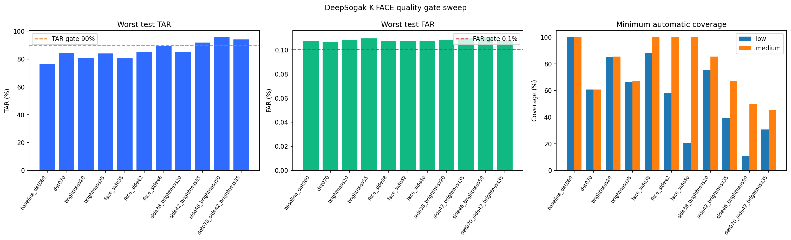

# K-FACE 400명 얼굴가드 품질 Gate 후보 분석

## 한 줄 결론

사진의 검출점수·얼굴 크기·밝기로 낮은 품질을 먼저 거절하면
본인 통과율(TAR)은 높아졌지만, **타인 오통과율(FAR) 0.1% 이하와
본인 통과율 90% 이상을 5번 반복에서 모두 만족한 품질 Gate는 없었다.**
현재 API의 판정 기준값과 자동 판정 흐름은 변경하지 않는다.

## 왜 이 실험을 했나

이전 864만 장 전체 반복 검증에서 중화질 질의는 잘 인식했지만,
저화질 질의의 최악 TAR은 등록 5장 기준 `76.35%`였다. 모든 사진을
억지로 판정하기보다 정확한 판정이 어려운 사진에는 재촬영·수동 확인을
요청하는 편이 안전하다. 이를 위해 실제 API에서 계산 가능한 값들로
품질 Gate 후보를 비교했다.

- SCRFD 얼굴 검출점수
- 원본 크기에서 얼굴이 차지하는 실제 픽셀 크기
- 평균 밝기

핵심 발견은 **검출점수만으로는 저화질과 중화질 실패를 구분하기
어렵다**는 것이다. 저화질 얼굴의 중앙 크기는 약 `42.81px`, 중화질은
약 `84.68px`였으므로 실제 얼굴 픽셀 크기를 함께 사용해야 했다.

## 실험 설계

| 항목 | 내용 |
|---|---|
| 데이터 | AI-Hub 승인 K-FACE 400명 저·중화질 전체 처리본 |
| 입력 | ArcFace 512차원 특징값 16.085GB, 8,800 chunk |
| 등록 | 중화질 등록 사진 5장 평균 |
| 품질 후보 | 검출점수·얼굴 픽셀 크기·밝기 조합 11개 |
| 누수 방지 | 등록에 쓴 이미지를 질의에서 제외, 인물 단위 validation/test 분리 |
| 반복 | seed 5개 |
| 기준값 선택 | validation FAR 0.09% 목표 |
| 최종 연구 Gate | test TAR 90% 이상, FAR 0.1% 이하 |
| 추가 지표 | 자동 판정 coverage: 재촬영 없이 처리할 수 있는 질의 비율 |
| 실행 | Kaggle Private Dataset, Tesla T4, CUDA |

입력 원본·얼굴 이미지·임베딩·인물 ID·개별 점수는 Kaggle Output과
GitHub에 저장하지 않았다. 집계 JSON, 그래프와 실행 로그만 남겼다.

## 주요 결과

아래는 5번 반복 중 가장 나쁜 test 결과다. coverage는 저·중화질 중
더 낮은 비율을 사용했다.

| 품질 조건 | 최악 TAR | 최악 FAR | 최소 coverage | 판정 |
|---|---:|---:|---:|---|
| 기준: 검출점수 0.60 | 76.35% | 0.1073% | 100.00% | 미통과 |
| 얼굴 크기 42px 이상 | 85.35% | 0.1073% | 58.12% | 미통과 |
| 얼굴 42px + 밝기 35 이상 | **91.82%** | 0.1094% | 39.44% | FAR 미통과 |
| 검출 0.70 + 얼굴 42px + 밝기 35 | **94.17%** | 0.1074% | 30.62% | FAR 미통과 |
| 얼굴 46px + 밝기 50 이상 | **95.72%** | 0.1105% | 10.77% | FAR·coverage 미통과 |

11개 후보 전체는 [`kface_quality_gate_analysis.json`](kface_quality_gate_analysis.json)에
있다. 가장 균형이 좋은 두 후보는 5번 중 4번 Gate를 통과했지만,
seed `20260819`의 FAR이 각각 `0.1094%`, `0.1074%`로 목표를 초과했다.

## 쉽게 해석하면

- 사진이 크고 밝으면 같은 사람을 놓치는 문제는 줄어든다.
- 하지만 품질 필터가 닮은 다른 사람을 걸러내는 문제까지 해결하지는
  못했다.
- 정확도를 높이려고 조건을 엄격하게 하면 저화질 사진 10장 중 7장
  정도에 재촬영을 요청하게 된다.
- 따라서 품질 Gate는 보조 안전장치로는 유용하지만, ArcFace 비교
  방식의 다음 고도화를 대신할 수 없다.

## API 결정

- 새 K-FACE 기준값을 기본 API에 적용하지 않는다.
- `threshold_status=research_only_unapproved`를 유지한다.
- 이번 Gate를 강제하는 `RETRY_REQUIRED`도 기본값으로 추가하지 않는다.
- 현재 API가 반환하는 검출점수·얼굴 비율·밝기 수치는 진단과
  시연용으로 계속 사용한다.

## 다음 개선 순서

1. **기준값 안전 여유 탐색**: 상위 품질 후보에서 validation FAR
   0.09%보다 엄격한 0.08%·0.07%를 독립 분할로 비교한다.
2. **품질 가중 등록**: 등록 5장을 단순 평균하지 않고, 얼굴 크기·밝기·
   검출점수에 따라 가중평균한다.
3. **다중 등록 중심**: 정면·측면 등 여러 모습을 하나로 섞지 않고 2개
   등록 중심으로 비교한다.
4. 위 후보를 동일한 400명·5 seed·FAR/TAR/coverage로 다시 검증한다.
5. 통과해도 실제 웹 재압축 이미지와 동의받은 모바일 촬영으로 외부
   검증하기 전에는 운영값으로 승인하지 않는다.

## 재현 자료

- Kaggle Notebook: [k-face-quality-gate-analysis](https://www.kaggle.com/code/hywznn/k-face-quality-gate-analysis)
- 집계 결과: [`kface_quality_gate_analysis.json`](kface_quality_gate_analysis.json)
- 그래프: [`kface_quality_gate_analysis.png`](kface_quality_gate_analysis.png)
- 실행 로그: [`k-face-quality-gate-analysis.log`](k-face-quality-gate-analysis.log)
- 분석 코드: [`scripts/analyze_kface_quality_gates.py`](../../../scripts/analyze_kface_quality_gates.py)
- Notebook 생성기: [`scripts/build_kface_quality_gate_kaggle_notebook.py`](../../../scripts/build_kface_quality_gate_kaggle_notebook.py)

Tesla T4에서 400명 등록 준비와 11개 후보 전체 비교는 약
`3.66분`이 걸렸다. 실행 종료 상태는 `COMPLETE`였다.
