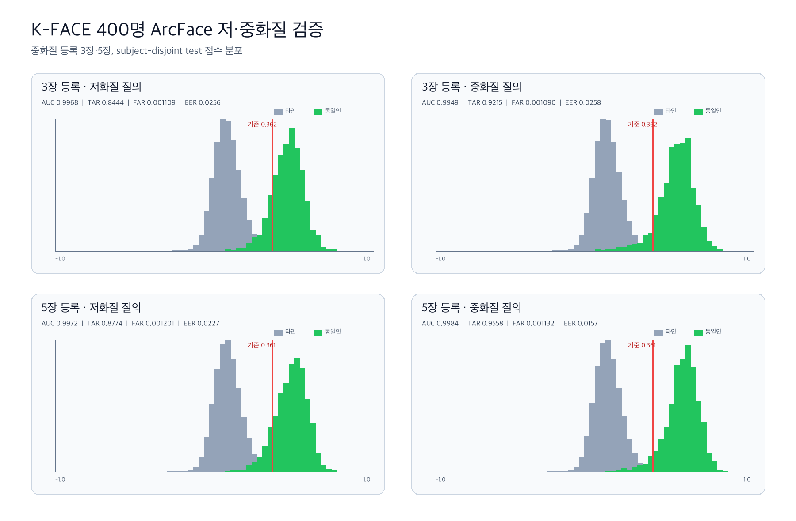

# K-FACE 400명 저·중화질 ArcFace v3 검증

## 한 줄 결론

중화질 등록 사진을 **5장** 쓰면 3장보다 본인 통과율이 저화질에서
`3.31%p`, 중화질에서 `3.43%p` 높아졌다. 그러나 test FAR이
목표 `0.1%` 대비 최대 `0.1201%`로 측정됐고 저화질 TAR도
목표 `90%`보다 낮아 **5장 등록은 시연 권장값으로만 사용하고 운영
기준값은 승인하지 않는다.**

## 이 실험이 답하는 질문

> 한국인 사용자가 중화질 사진 3장 또는 5장으로 얼굴을 등록했을 때,
> 저화질·중화질 후보에서 본인을 찾고 타인 오통과를 제어할 수 있는가?

이 실험은 **동일인 얼굴 검증**이다. K-FACE는 실제 얼굴 데이터이므로
이 결과를 딥페이크 탐지 정확도로 해석하지 않는다. 딥페이크 조작 여부는
별도 EfficientNet-B4 ONNX 모델이 판별한다.

## 데이터와 처리 범위

| 항목 | 저화질 | 중화질 |
|---|---:|---:|
| AI-Hub 승인 K-FACE 인물 | 400명 | 400명 |
| 선택 이미지 | 6,000장 | 6,000장 |
| 인물당 선택 | 15장 | 15장 |
| ZIP 크기 | 10,442,596,690 bytes | 25,001,457,787 bytes |
| ZIP SHA-256 | `c92caee1...2a428f` | `875cfc70...175c9` |
| ArcFace 처리 시간 | 1,165.27초 | 1,135.02초 |

- 인물별 10,800장을 모두 추론하지 않고, 정렬된 목록에서 15장을 균등
  간격으로 골라 대표 조건을 쓰도록 했다.
- SCRFD로 얼굴을 검출·정렬하고 `buffalo_l` ArcFace로 512차원 임베딩을
  만들었다.
- 원본 ZIP은 로컬 비공개 폴더에서만 읽었고 압축 해제된 얼굴, 원본 경로,
  인물 식별자와 개별 임베딩은 GitHub에 올리지 않았다.
- 실행은 Apple Silicon Mac, ONNX Runtime `CPUExecutionProvider`에서 수행했다.
- 모델 fingerprint는
  `4e912492f26ec02de957b2a572b9b847661d480393c40280dbc617b013eca803`이다.

## 1. 얼굴 특징 추출 성공률

| 지표 | 저화질 | 중화질 | 차이 |
|---|---:|---:|---:|
| 성공 | 4,732장 | 5,307장 | +575장 |
| 제외 | 1,268장 | 693장 | -575장 |
| 성공률 | **78.87%** | **88.45%** | **+9.58%p** |
| 얼굴 미검출 | 704장 | 291장 | -413장 |
| 검출 신뢰도 미달 | 564장 | 402장 | -162장 |

제외은 “다른 사람으로 오판”이 아니라 얼굴 특징을 만들지 못해 비교 전에
거절된 입력이다. 중화질은 저화질보다 얼굴 미검출을 크게 줄였다.

| 특징 안정성 | 저화질 | 중화질 |
|---|---:|---:|
| 인물 내부 유사도 평균 | 0.6144 | **0.6652** |
| 인물 내부 유사도 중앙값 | 0.6227 | **0.6801** |

같은 사람의 저·중화질 중심 특징 간 유사도는 평균 `0.9180`, 중앙값
`0.9211`이었다. 화질이 바뀌어도 인물 특징 방향은 대체로 유지됐지만,
이 값은 확률이나 운영 신뢰도가 아니다.

## 2. 3장·5장 등록 검증 방법

1. 400명을 고정 seed `20260815`로 validation 200명과 test 200명으로 나뉘다.
2. 중화질 성공 임베딩 중 3장 또는 5장을 균등 간격으로 골라 등록
   중심을 만들었다.
3. 등록에 쓴 촬영 위치는 저·중화질 질의에서 모두 제외했다.
4. 본인 질의는 자신의 등록 중심과, 타인 질의는 같은 split의 나머지
   인물 등록 중심과 비교했다.
5. 기준값은 validation에서만 골랐다. 저·중화질 모두에서 FAR `0.001`을
   넘지 않도록 두 후보 중 더 엄격한 값을 선택했다.
6. 선택한 기준값을 test 200명에 변경 없이 적용했다.

## 3. Subject-disjoint test 결과

### 중화질 3장 등록

- validation에서 선택한 공통 기준값: `0.362225`

| Test 지표 | 저화질 질의 | 중화질 질의 |
|---|---:|---:|
| 본인 질의 | 1,799건 | 2,051건 |
| 타인 비교 | 358,001건 | 408,149건 |
| ROC-AUC | 0.996823 | 0.994860 |
| EER | 2.56% | 2.58% |
| TAR | **84.44%** | **92.15%** |
| FRR | 15.56% | 7.85% |
| FAR | **0.1109%** | **0.1090%** |

### 중화질 5장 등록

- validation에서 선택한 공통 기준값: `0.361413`

| Test 지표 | 저화질 질의 | 중화질 질의 |
|---|---:|---:|
| 본인 질의 | 1,452건 | 1,651건 |
| 타인 비교 | 288,948건 | 328,549건 |
| ROC-AUC | 0.997152 | **0.998393** |
| EER | 2.27% | **1.57%** |
| TAR | **87.74%** | **95.58%** |
| FRR | 12.26% | **4.42%** |
| FAR | **0.1201%** | **0.1132%** |

5장 등록은 3장 등록보다 TAR이 저화질에서 `3.31%p`, 중화질에서
`3.43%p` 개선됐다. 다만 사진 수가 늘어나도 저화질에서는 본인의
`12.26%`를 거절했고, test FAR도 목표를 소폭 초과했다.

## 4. Gate 판정과 API 적용

| 조건 | 목표 | 3장 최악 결과 | 5장 최악 결과 | 판정 |
|---|---:|---:|---:|---|
| 본인 통과 TAR | 90% 이상 | 84.44% | 87.74% | 미통과 |
| 타인 오통과 FAR | 0.1% 이하 | 0.1109% | 0.1201% | 미통과 |

- 시연 등록 사진은 3장보다 **5장을 권장**한다.
- K-FACE 기준값 `0.361413`은 연구 후보로만 기록하고 현재 API의 운영
  기준값을 자동 교체하지 않는다.
- API에서는 `threshold_status=research_only_unapproved`를 유지하고, 얼굴 유사도를
  확률로 표시하지 않는다.
- 결과만으로 피해를 확정하거나 자동 신고·자동 차단하지 않는다.

## 5. 이 결과의 한계

- K-FACE는 통제된 촬영 데이터이므로 실제 공개 웹·SNS 재압축 이미지를
  대표하지 않는다.
- 이번 15장은 파일 정렬 기준 균등 표본이다. 각도·조명·표정·가림
  메타정보를 이용한 조건별 신뢰구간은 후속 검증이 필요하다.
- 임계값은 seed 1개에서 정했다. 인물 단위 bootstrap 95% 신뢰구간과
  반복 seed 검증이 아직 없다.
- 이번 결과는 사전학습 `buffalo_l`의 평가이며 K-FACE로 파인튜닝한 결과가
  아니다.
- InsightFace 제공 사전학습 가중치는 비상업 연구 조건으로만 사용했다.

## 6. 다음 순서

1. 인물 단위 bootstrap과 추가 seed로 TAR·FAR 95% 신뢰구간을 계산한다.
2. 저화질 `NO_FACE` 704장을 중심으로 SCRFD 입력 크기·검출 기준·정렬
   설정을 먼저 비교한다.
3. 각도·조명·표정·가림 조건별 TAR 하락을 측정한다.
4. 동의받은 실제 모바일·웹 재압축 이미지로 외부 검증한다.
5. 전처리 개선 후에도 Gate가 부족할 때만 상용 허용 가중치와 인물
   단위 Train/Validation/Test 분리로 파인튜닝을 검토한다.

## 재현 자료

- [검증 집계 JSON](kface_v3_400_verification.json)
- [저·중화질 비교 JSON](kface_low_medium_comparison.json)
- [중화질 전체 ZIP inventory](medium_inventory.json)
- [검증 점수 분포 그래프](kface_v3_400_verification.png)
- 추론: [`scripts/kface_pilot.py`](../../../scripts/kface_pilot.py)
- 3장·5장 검증: [`scripts/evaluate_kface_verification.py`](../../../scripts/evaluate_kface_verification.py)
- 그래프: [`scripts/plot_kface_verification.py`](../../../scripts/plot_kface_verification.py)
